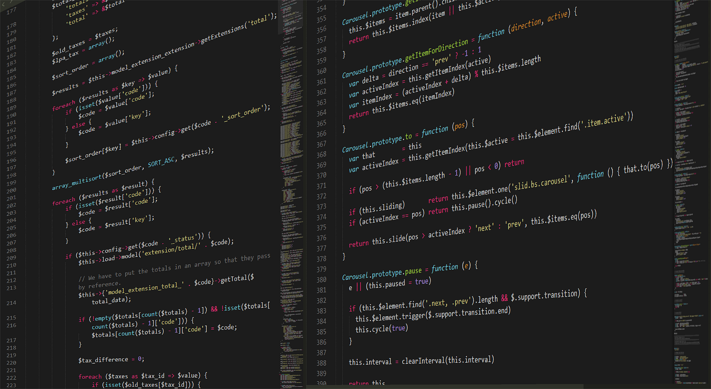

## Track002 - html + css + js/jquery (WEB BASIC) (20250825~20250829)
1. 웹의 작업순서
   1) html 구조
   2) css 꾸미기
   3) js/jquery / react 동작
   4) jsp + oracle  서버전송 + 데이터저장

2. html 파일템플릿
- ! + enter
- html : 문서의 시작과 끝
- head : 문서 정보
- body : 사용자에게 보이는 내용
- 다소문자 / 시작태그와~ 끝나는태그

```bash
<!DOCTYPE html>
<html lang="ko">
<head>
    <meta charset="UTF-8">
    <meta name="viewport" content="width=device-width, initial-scale=1.0">
    <title>web basic001</title>
</head>
<body>
   안녕 Html 
</body>
</html>
```

```bash
# ■ WebBasic
### 3. Tag
1. 웹페이지의 구성요소를 알려주는 표시언어
2. h1~h6  제목
   - h1 : 로고, 상호명
   - h2 : 주메뉴
   - h3~h6 : 중요도 상세메뉴 (소제목)
3. p, pre : 문단
   - p : 일반문단
   - pre : 줄바꿈과 공백을 유지하는 서식텍스트
4. img  : 이미지
   - src : 경로  , alt : 대체용어 
5. a : 링크
   - href : 다른페이지나 파일로 연결 , target="_blank" 새창열기
6. 리스트태그 : ul , ol, dl
   - ul  : 순서없는리스트
   - ol  : 순서있는리스트
   - dl  : 설명리스트  
7. 그룹핑 : div

`web002_basic.html`      
```

```bash 
# ■ WebBasic
### 3. Tag  (연습문제 - a태그까지 정리)
1. 웹페이지의 구성요소를 알려주는 표시언어
2. h1~h6  제목
   - h1 : 로고, 상호명
   - h2 : 주메뉴
   - h3~h6 : 중요도 상세메뉴 (소제목)
3. p, pre : 문단
   - p : 일반문단
   - pre : 줄바꿈과 공백을 유지하는 서식텍스트
4. img  : 이미지
   - src : 경로  , alt : 대체용어 
5. a : 링크
   - href : 다른페이지나 파일로 연결 , target="_blank" 새창열기
6. 리스트태그 : ul , ol, dl
   - ul  : 순서없는리스트
   - ol  : 순서있는리스트
   - dl  : 설명리스트  
7. 그룹핑 : div

`web002_basic.html`      

### 4. CSS
1. 여백 - margin / padding
   1. margin : 바깥쪽여백
   2. padding : 안쪽여백

2. 글자스타일
   1.글자색상
      color:red
   2.글자크기
      font-size:16px
   3.정렬
      text-align:center /left /right/justify 문단의 정렬을 체크해주는 부분인데 left(왼쪽정렬) , right(오른쪽정렬) , center(중앙) , justify(수평정렬)
   4.밑줄
      text-decoration:none; 깃허브
   5. 글꼴
      font-family:sans-serif;
   6. 굵게
      font-weight:bold;

3. 배경꾸미기
      background-color: gold;
      background:black;
      background:linear-gradient(to right, pink, orange) background:linear-gradient(45deg, pink, orange)
      background: red url(./img/five.png) repeat center / 20px 20px
                  색상 경로 반복여부 중앙배치 가로사이즈 세로사이즈  

4. 박스디자인
   1. 가로 : width:300px
   2. 선 : border:3px solid red
   3. 둥근모서리 : borer-radius : 20px
   4. 그림자효과 : box-shadow: 0 4px 12px rgba(0,0,0,0.5)
```

```bash
# ■ WebBasic
### 3. Tag  (연습문제 - a태그까지 정리)
1. 웹페이지의 구성요소를 알려주는 표시언어
2. h1~h6  제목 
   - h1 : 로고, 상호명 
   - h2 : 주메뉴 
   - h3~h6 : 중요도 상세메뉴 (소제목)
3. p, pre : 문단
   - p : 일반문단
   - pre : 줄바꿈과 공백을 유지하는 서식텍스트
4. img  : 이미지
   - src : 경로  , alt : 대체용어 
5. a : 링크
   - href : 다른페이지나 파일로 연결 , target="_blank" 새창열기
6. 리스트태그 : ul , ol, dl
   - ul  : 순서없는리스트
   - ol  : 순서있는리스트
   - dl  : 설명리스트  
7. 그룹핑 : div

`web002_basic.html`      
```

```bash
### 4. CSS
1. 여백 - margin / padding
   1. margin : 바깥쪽여백
   2. padding : 안쪽여백

2. 글자스타일
   1.글자색상
      color:red
   2.글자크기
      font-size:16px
   3.정렬
      text-align:center /left /right/justify 문단의 정렬을 체크해주는 부분인데 left(왼쪽정렬) , right(오른쪽정렬) , center(중앙) , justify(수평정렬)
   4.밑줄
      text-decoration:none; 깃허브
   5. 글꼴
      font-family:sans-serif;
   6. 굵게
      font-weight:bold;

3. 배경꾸미기
      background-color: gold;
      background:black;
      background:linear-gradient(to right, pink, orange) background:linear-gradient(45deg, pink, orange)
      background: red url(./img/five.png) repeat center / 20px 20px
                  색상 경로 반복여부 중앙배치 가로사이즈 세로사이즈  

4. 박스디자인
   1. 가로 : width:300px
   2. 선 : border:3px solid red
   3. 둥근모서리 : borer-radius : 20px
   4. 그림자효과 : box-shadow: 0 4px 12px rgba(0,0,0,0.5)
```

---

```bash
## Track002 - html + css + js/jquery (WEB BASIC) (20250825~20250829)
```

---
# ■ WebBasic
### 3. Tag  (연습문제 - a태그까지 정리)
1. 웹페이지의 구성요소를 알려주는 표시언어
2. h1~h6  제목
   - h1 : 로고, 상호명
   - h2 : 주메뉴
   - h3~h6 : 중요도 상세메뉴 (소제목)
3. p, pre : 문단
   - p : 일반문단
   - pre : 줄바꿈과 공백을 유지하는 서식텍스트
4. img  : 이미지
   - src : 경로  , alt : 대체용어 
5. a : 링크
   - href : 다른페이지나 파일로 연결 , target="_blank" 새창열기
6. 리스트태그 : ul , ol, dl
   - ul  : 순서없는리스트
   - ol  : 순서있는리스트
   - dl  : 설명리스트  
7. 그룹핑 : div

`web002_basic.html`      

### 4. CSS
1. 여백 - margin / padding
   1. margin : 바깥쪽여백
   2. padding : 안쪽여백

2. 글자스타일
   1.글자색상
      color:red
   2.글자크기
      font-size:16px
   3.정렬
      text-align:center /left /right/justify 문단의 정렬을 체크해주는 부분인데 left(왼쪽정렬) , right(오른쪽정렬) , center(중앙) , justify(수평정렬)
   4.밑줄
      text-decoration:none; 깃허브
   5. 글꼴
      font-family:sans-serif;
   6. 굵게
      font-weight:bold;

3. 배경꾸미기
      background-color: gold;
      background:black;
      background:linear-gradient(to right, pink, orange) background:linear-gradient(45deg, pink, orange)
      background: red url(./img/five.png) repeat center / 20px 20px
                  색상 경로 반복여부 중앙배치 가로사이즈 세로사이즈  

4. 박스디자인
   1. 가로 : width:300px
   2. 선 : border:3px solid red
   3. 둥근모서리 : borer-radius : 20px
   4. 그림자효과 : box-shadow: 0 4px 12px rgba(0,0,0,0.5)

> 1. CSS 연습문제  `web003_1_user.html`
> 2. MARKUP 연습문제  `web003_2_users.html`

---
---

# ■ WebBasic
## 5. css 내부적용 id  vs  class
1. id? 유일한 값
2. id 특징
- html 문서에서 한번만 사용가능
- 중복불가
- css에서 #id명
- 우선순위가 id와 class모두 있을때 id가 더 높음

3.class? 여러개 선택시
4. class 의 특징
- 재사용가능 : 여러요소에 class 지정
- 하나의 요소에 여러개의 class 사용가능
- css에서 .class명
- 반복스타일에 적합
---
---
## wed basic

---
<!DOCTYPE html>
<html lang="en">
<head>
  <meta charset="UTF-8">
  <meta name="viewport" content="width=device-width, initial-scale=1.0">
  <title>ID VS CLASS</title>
  <style>
    /* 전체선택자 - 전체여백빼기*/
    * {margin:0; padding:0;}
    /* body - 좋이하는 글꼴 선택 */
    body{ font-family: 'Fraklin Gothic Medium', 
                        'Arial Narrow', Arial , sans-serif;
      background-image: linear-gradient(135deg, white, green);
    }
    /* Q1. h3 중앙정렬, 글자색상 : #e1360c, 아래쪽여백 : 10px*/
    h3{ text-align: center; color:aqua ; margin-bottom:10px; }
 
    /* Q2. p 중앙정렬, 글자크기 : 14px, 글자색상 : #666, 아래쪽여백 : 20px */
    p { text-align: center; font-size: 14px; color:aquamarine; margin-bottom:20px}
    /* Q3. div 배경색상 : #fff,
                  너비 : 300px, 
                  여백 : 위아래 30px 좌우 중앙정렬, 
               안쪽여백 : 20px, 
           테두리 둥글게 : 15px,
            그림자효과, 왼쪽정렬 */
    div {background-color: #34c0ef; width: 300px; 
                   margin:30px auto;
                  padding:20px; 
            border-radius:15px; 
               box-shadow: 0 4px 12px rgba(0,0,0,0.1);
               text-align:left;}
    /* Q4. dt 글자굵기 : 굵게, 아래쪽여백 : 10px, 글자색상 : #333 */
    dt {font-weight:bold; margin-bottom:10px; color: rgb(42, 29, 182);}
    /* Q5. dd 글자크기 : 14px, 글자색상 : #666, 아래쪽여백 : 8px, 왼쪽 안쪽여백 : 10px */
    dd { font-size: 14px; color: rgb(31, 146, 90); margin-bottom:8px; padding-left: 10px;}
    /* Q6. id1, id2 글자색상 :  각각 색상다르게 글자굵기 : 굵게 */
    #id1, #id2{font-weight: bold; }
    #id1{font-weight: bold; color:#0d90bc; background-color: whitesmoke;}
    #id2{font-weight: bold; color:rgb(7, 48, 211); background-color: rgba(255, 255, 255, 0.881);}

    /* Q7. class=""
            .mycss 배경색상 : #f9f1f7, 왼쪽 테두리 : 4px 실선 #e1306c, 안쪽여백 : 5px 10px, 테두리 둥글게 : 5px */
    .mycss{background-color: antiquewhite;
                border-left: 4px solid greenyellow;
                    padding:5px;
              border-radius: 5px; }
---

---
  </style>
</head>
<body>
  <div>
    <h3> id </h3>
    <p>유일한 값(고유식별자)</p> 
    <dl>
      <dt>id의 특징</dt>
      <dd>html문서에서 한 번만 사용가능</dd>
      <dd id="id1">중복불가</dd>
      <dd id="id2">css에서 #id명</dd>
      <dd>우선순위가 id와 class 모두 있을때 id가 더 높음</dd>
    </dl>
  </div><!-- end div-->
---

---
  <div>
    <h3>class</h3>
    <p>여러개 선택시</p>
    <dl>
      <dt>class의 특징</dt>
      <dd class="mycss1">재사용가능 : 여러요소에 class 지정</dd>
      <dd>하나의 요소에 여러개의 class 사용가능</dd>
      <dd class="mycss2">css에서 .class명</dd>
      <dd>반복스타일에 적합</dd>
    </dl>
  </div><!-- end div-->
</body>
</html>
---

```


```bash

---
<!DOCTYPE html>
<html lang="en">
<head>
    <meta charset="UTF-8">
    <meta name="viewport" content="width=device-width, initial-scale=1.0">
    <title>Document</title>
    <style>
          /* Q1. body 여백제거, 안쪽여백 : 30px, 글꼴 : 'Segoe UI', 배경 : 그라디언트 #fff1eb → #ace0f9 */
          body{margin: 0; padding: 30px; font-family: 'Segoe UI'; 
                background-image: linear-gradient(135deg, rgb(107, 210, 210), whitesmoke); }
          /* Q2. h1 중앙정렬, 글자색상 : #34495e, 아래쪽여백 : 40px */
          h1{ text-align: center; color:#34495e; margin-bottom: 40px;}
          /* Q3. .portfolio 너비 : 250px, 여백 : 아래쪽 30px 중앙정렬, 테두리 둥글게 : 20px, 그림자효과, 안쪽여백 : 20px, 트랜지션 : 0.3초 */
          .portfolio{width: 250px; margin: 0 auto 30px; border-radius: 20px; box-shadow: 0 4px 12px rgba(0,0,0,0.1);
                    padding: 20px; transition: all 0.3s; cursor:pointer;}
          /* Q4. .portfolio:hover 확대 + 회전 + 밝기 + 그림자 강조 */
          .portfolio:hover{transform: scale(1.05) rotate(-1deg); 
                            filter:brightness(1.05);
                            box-shadow:0 4px 12px rgba(0,0,0,0.25);}
          /* Q5. .project1 배경 : 그라디언트 #fceabb → #f8b500 */
          .portfolio.project1{background-image: linear-gradient(135deg,#fceabb,#f8b500 );}
          /* Q6. .project2 배경 : 그라디언트 #d5fefd → #a1c4fd */
          .portfolio2{background-image: linear-gradient(135deg, #d5fefd, #a1c4fd);}
          /* Q7. .project3 배경 : 그라디언트 #fbc2eb → #a6c1ee */
          .portfolio3{background-image: linear-gradient(#fbc2eb,#a6c1ee )}
          /* Q8. .portfolio img 너비/높이 : 90px, 원형처리, 이미지 비율 유지, 테두리 : 3px 실선 #34495e */
          .portfolio img{width: 150px; height:90px; border-radius: 20px;
                         object-fit:cover; border:3px solid#34495e;
                          display:block; margin:auto; }
          /* Q9. .portfolio h2 여백 : 위10px 아래5px, 글자크기 : 18px, 글자색상 : #2c3e50 */
          .portfolio h2{ margin: 10px 0 5px; font-size: 18px; color:#2c3e50;}
         /* Q10. .portfolio p 글자크기 : 14px, 글자색상 : #555, 아래쪽여백 : 10px */
         .portfolio p{font-size: 14px; color: #555; margin-bottom: 10px;}
         /* Q11. .portfolio a 글자크기 : 13px, 글자색상 : #34495e, 밑줄 제거 */
         .portfolio a{font-size: 13px; color:#34495e; text-decoration:none;  }
         /* Q12. .portfolio h3 위쪽여백 : 20px, 글자크기 : 16px, 글자색상 : #2c3e50 */
         .portfolio h3{margin-top: 20px; font-size: 16px; color:#2c3e50;}
         /* Q13. .portfolio ul 왼쪽정렬, 왼쪽 안쪽여백 : 20px, 글자색상 : #2c3e50  */ 
         .portfolio ul{text-align: center; padding-left: 20px; color:#2c3e50; }

    </style>
</head>
<body>
    <div>
        <h1>프로젝트 설명 카드</h1>
        <div class="portfolio project1">
            <p></p>
            <h2>도서 추천 웹앱</h2>
            <p>기획자: 사장님</p>
            <p>사용자 취향 기반으로 도서를 추천하는 웹 서비스</p>
            <p><a href="" title="">GitHub 저장소 보기</a></p>
            <h3> 핵심 기능</h3>
            <ul>
                <li>사용자 입력 기반 추천 알고리즘</li>
                <li>카드 UI를 활용한 도서 정보 시각화</li>
                <li>팀원 역할 분담 및 협업 관리</li>
            </ul>
        </div>
        <div class="portfolio project2">
            <p></p>
            <h2>반응형 포트폴리오 사이트</h2>
            <p>프론트엔드: June</p>
            <p>디자이너와 협업하여 제작한 개인 포트폴리오 웹사이트</p>
            <p><a href="" title="">배포된 페이지 보기</a></p>
            <h3> 주요 기술</h3>
            <ul>
                <li>HTML5 / CSS3 / JavaScript</li>
                <li>미디어쿼리를 활용한 반응형 디자인</li>
                <li>Figma 기반 UI 설계</li>
            </ul>
        </div>

        <div class="portfolio project3">
            <p></p>
            <h2>AI 기반 독서 취향 분석기</h2>
            <p>AI 분석: Mina</p>
            <p>독서 이력 데이터를 기반으로 취향을 분석하고 도서를 추천</p>
            <p><a href="" title="">프로젝트 상세 보기</a></p>
            <h3> 기술 스택</h3>
            <ul>
                <li>Python / Pandas / Scikit-learn</li>
                <li>자연어 처리 기반 키워드 분석</li>
                <li>데이터 시각화 및 사용자 피드백 반영</li>
            </ul>
        </div>

    </div>
</body>
</html>

---
---

---
# ■ WebBasic
```bash
## 6 배치요소


■1. Web  Basic  복습문제
■1. Web  Basic  복습문제
■1. Web  Basic  복습문제
■1. Web  Basic  복습문제

### 1. block vs inline
1) box model  
- 콘텐츠가 자리하는 영역을 의미하며, 박스의 구성 요소는 
   content(내용)  ,  padding , border , margin 로 이루어진다.

2) block 요소  
- width/height 설정이 (O/X): O  
- 앞뒤 줄바꿈이 (O/X): O  
- 대표 태그: div , p , h3

3) inline 요소  
- width/height 설정이 (O/X): X  
- 앞뒤 줄바꿈이 (O/X): X  
- 대표 태그: a, strong , span


### 2. 배치(1) - float
- 요소를 좌우로 배치할 때 사용하는 속성은  float 이다.  
- 다음 요소의 흐름을 정리하려면 clear속성을 사용한다.  
- float를 끊는 대표적인 방법은 클래스명으로  .clear 를 사용한다.
.clear{  clear:both ; }

### 3. 배치(2) - position
- 자식 요소를 부모 기준으로 위치시키려면 부모에  relative , 자식에 absolute를 설정한다.  
- 브라우저 전체 기준으로 고정하려면 fixed 속성을 사용한다.  
- position의 주요 값 4가지는  relative , absolute , fixed , static 이다.


### 4. 배치(3) - display

- 요소의 기본 속성을 바꾸려면 display 속성을 사용한다.  
- block 요소를 inline처럼 보이게 하려면 inline,  
  inline 요소를 block처럼 보이게 하려면 block 값을 사용한다.


```


---
<!DOCTYPE html>
<html lang="en">
<head>
    <meta charset="UTF-8">
    <meta name="viewport" content="width=device-width, initial-scale=1.0">
    <title>나의 포트폴리오</title>
    <style>
/* Q1: 페이지 전체에 배경 그라디언트를 적용하고 기본 글꼴과 안쪽 여백을 주려면
   - 배경: 135도 방향의 그라디언트 (#f0f9ff → #e0f7fa)
   - 글꼴: Arial
   - 안쪽 여백: 30px */
 *{margin:0; padding:0; box-sizing: border-box;}
 body{
    font-family: 'Franklin Gothic Medium', 'Arial Narrow', Arial, sans-serif;
    background-image: linear-gradient(135deg,#f0f9ffe3, #e0f7fac1);
    padding: 30px
}

/* Q2: 제목(h1)을 가운데 정렬하고 색상과 아래 여백을 주려면?
   - 정렬: 가운데
   - 글자 색상: #00796b (청록색 계열)
   - 아래 여백: 40px */
h1{
    text-align: center; color: #04796b;
    margin-bottom: 40px;
}

/* Q3: 콘텐츠 박스를 가운데 배치하고 너비를 50%로 설정하려면?
   - 너비: 50%
   - 좌우 자동 마진으로 가운데 정렬 */
.container{width: 50%; margin:auto;}

/* Q4: 카드 박스를 가로로 배치하고 시각적 스타일을 주려면?
   - float: left (가로 정렬)
   - 너비: 250px
   - 바깥 여백: 20px
   - 안쪽 여백: 20px
   - 배경색: 흰색 (#ffffff)
   - 모서리 둥글게: 15px
   - 그림자: 흐림 효과 (10px)
   - 위치 기준점: relative
   - 텍스트 가운데 정렬
   - 애니메이션: 등장 시 아래에서 위로 이동 (translateY)
   - 테두리: 투명 3px, 배경 클립 설정 */
.card{
    float: left;
    width: 250px;
    margin: 20px;
    padding: 20px;
    background-color: #ffffffe2;
    border-radius:15px;
    box-shadow: 0 0 10px rgba(0,0,0,0.1);
    position:relative;
    text-align: center;
    transition:all 0.3s ease;
    transform:translateY(20px);
    border:3px solid transparent;
    background-clip: padding-box;
    opacity:0; /*## 화면에 안보이기 - 투명도*/
    animation:fadeInup        0.8s            ease                 forwards; 
    /*##     애니메이션이름    지속시간       처음과끝느리게      애니메이션끝나도마지막상태유지*/
}


/* Q5: 두 번째 카드에 애니메이션 지연을 주려면?
   - 지연 시간: 0.3초
   .card를 대상으로 nth-of-type
   부모를 기준으로   nth-child */ 
   .card:nth-of-type(1){
    animation-delay: 0.3s;
    }
    .card:nth-of-type(2){
    animation-delay: 0.6s;
    }
    .card:nth-of-type(3){
    animation-delay: 0.9s;
    }


/* Q6: 카드에 마우스를 올렸을 때 효과를 주려면?
   - 위로 이동: 5px
   - 그림자 강조: 15px
   - 테두리 색상 변경: #00796b */
.card:hover{
    transform:translateY(-5px);
    box-shadow:0 0 15px rgba(0,0,0,0.2);
    border:3px solid #059887;
}


/* Q7: 카드에 마우스를 올렸을 때 그라디언트 테두리를 나타내려면?
   - 위치: 카드 바깥쪽 (-3px)
   - 배경: 45도 방향의 그라디언트 (#00c9ff → #92fe9d)
   - 둥근 테두리: 18px
   - 투명도: hover 시 1로 변경 
   css에서는 border에 그라디언트색상을 줄수 없음!
   1) : before  가상요소 카드보다 살짝 크게 만들기
   */
    .card:before{
        content:"" ;
        position: absolute;
        top: 3px; left: 3px; right: 3px; bottom: 3px;
        background-image: linear-gradient(45deg, #00c8fff5, #92fe9df7);
        border-radius:15px;
        opacity: 0;
        z-index:-1;
        transition: opacity 0.5s ease;
    }

.card:hover::before{
    opacity:1;
}

/* Q8: 카드 이미지에 크기와 스타일을 주려면?
   - 너비: 120px
   - 높이: 80px
   - 둥근 모서리: 10px
   - 이미지 비율 유지: object-fit: cover
   - 테두리 색상: #00796b */
.card img{
    width:120px;
    height:80px;
    border-radius:10px;
    object-fit: cover;
    border:3px solid #058071;
}

/* Q9: 카드 제목(h2)에 글자 크기와 여백, 색상을 주려면?
   - 글자 크기: 18px
   - 여백: 위 15px, 아래 10px
   - 색상: #333 (진회색) */
h2{
    font-size: 18px;
    margin:15px 0 10px;
    color:#333333e8;
}

/* Q10: 카드 설명(p)에 글자 크기와 색상, 아래 여백을 주려면?
   - 글자 크기: 14px
   - 색상: #555 (중간 회색)
   - 아래 여백: 10px */
p{
    font-size: 14px;
    color:#555555f5;
    margin-bottom: 10px;
}

/* Q11: 카드 오른쪽 상단에 고정된 버튼을 만들고 스타일을 주려면?
   - 위치: absolute (top:10px, right:10px)
   - 배경색: #00796b
   - 글자색: 흰색
   - 패딩: 8px 12px
   - 둥근 모서리: 12px
   - 글자 크기: 13px */
.card .more-btn{
    position:absolute; 
    top:10px;
    right:10px;
    background-color: #03796b;
    color: white;
    padding: 8px, 12px;
    border-radius: 12px;
    font-size:13px;
    text-decoration:none;
    transition: background 0.3s ease ;
}


/* Q12: 버튼에 마우스를 올렸을 때 색상 변경과 흔들림 효과를 주려면?
   - 배경색 변경: #004d40
   - 애니메이션: shake (0.3초) */
   .card .more-btn:hover{
         background-color:#004d40;
        animation: shake 0.3s ease-in-out;
}

/* Q13: 흔들림(shake) 애니메이션을 정의하려면?
   - 좌우/상하로 2px씩 이동 반복 */
@keyframes shake {
     0%{ transform: translate(0,0);}
    25%{ transform: translate(2px,2px);}
    50%{ transform: translate(-2px,-2px);}
    75%{ transform: translate(2px,2px);}
   100%{ transform: translate(0,0);}

}


/* Q14: 카드가 아래에서 위로 부드럽게 등장하도록 애니메이션을 정의하려면?
   - 시작: opacity 0, translateY(20px)
   - 종료: opacity 1, translateY(0) */
   @keyframes fadeInup {
    to{
        opacity:1;
        transform:translateY(0);
    }
   }

/* Q15: float를 끊고 아래 설명 박스를 만들려면?
   - clear: both
   - 위 여백: 50px
   - 안쪽 여백: 15px
   - 배경색: #e0f2f1
   - 둥근 모서리: 10px
   - 텍스트 가운데 정렬, 글자색: #333 */
   .clear{ 
        clear:both; 
        margin: top 50px;
        background-color: #e0f2f1;
        border-radius:10px;
        padding:15px;
        text-align:center;
        color:#333;
}

    </style>
</head>
<body>
    <div>
        <div class="container">
            <h1>나의 포트폴리오</h1>
            <div class="card">
                <p></p>
                <h2> 쇼핑몰 웹앱</h2>
                <p>React + Firebase 기반의 쇼핑몰 웹 애플리케이션</p>
                <p>사용 기술: React, Firebase, Styled-components</p>
                <a href="" class="more-btn">더보기</a>
            </div>   <!-- end div 1-->


            <div class="card">
                <p></p>
                <h2> AI 챗봇 서비스</h2>
                <p>Python 기반의 자연어 처리 챗봇 시스템</p>
                <p>사용 기술: Flask, TensorFlow, NLP</p>
                <a href="" class="more-btn">더보기</a>
            </div>   <!-- end div 2-->

            <div class="card">
                <p></p>
                <h2> 자연어 AI 챗봇 서비스</h2>
                <p>Python 기반의 자연어 처리 챗봇 시스템</p>
                <p>사용 기술: Flask, TensorFlow, NLP</p>
                <a href="" class="more-btn">더보기</a>
            </div>   <!-- end div 3-->

            <div class="clear">이 포트폴리오는 실제 프로젝트를 기반으로 구성되었으며,
                                각 프로젝트는 GitHub에서 확인할 수 있습니다.</div>
    </div>
</body>                         
</html>
---

---
## Track002 - html + css + js/jquery (WEB BASIC) (20250908~20250912)
<!DOCTYPE html>
<html lang="en">
<head>
    <meta charset="UTF-8">
    <meta name="viewport" content="width=device-width, initial-scale=1.0">
    <title>Document</title>
    <style>
        /*   Q1. 전체여백빼기
             box-sizing: border-box;  박스크기계산을 통일  ,
             width와 height에 padding 과 border까지 포함해서 계산
             박스크기가 100px, padding: 10px 자동으로 크지조절
        */
        *{  margin:0; padding:0; box-sizing: border-box;}

        /*   Q2. body 글꼴 , 전체배경색상  */
        body{ font-family: 'Franklin Gothic Medium', 'Arial Narrow', Arial, sans-serif; 
            background-image: linear-gradient(135deg, #f4ffb8 , #8affd0);
        }
       /*   Q3. h3 왼쪽에 선넣기 , 배경색  */
        h3{ border-left:3px solid #123456;
            border-bottom:1px solid #123456;
        }
       /*   Q4. strong 배경색  */
        strong{ background-color:crimson; color:whitesmoke; padding:2px;
            width:500px; /* 적용X inline */
        }
        /*   Q5. box 예)  */
        .container{ width:60%; margin:50px auto; background-color:#fff;
                    padding:20px; border-radius: 10px; box-shadow: 0 0 10px rgba(0,0,0,0.2);
        }
        .item{  padding:10px; background-color: #333; color:white;}

        /*  Q6. float  */
        .i1{float:left; box-sizing:100px;}
        .i2{float:right; }
        .i3{float:center; }

        /* Q7. position */
        .me{background-color: gold; padding: 10px; color: white;  
              top:0; left:0; 
        }
        .p1{position:relative;}  /*  1. 부모 (감싸는 박스에 공간확보)*/
        .p1  .me{position: absolute; right:0; bottom: 0;} /*  2.  자식(absolute)*/

        .p2  .me{position:fixed; bottom:100px; right: 0;  /* 브라우저기준*/
                background-color:red ;
            }
        /* Q8. display */
        .dl li {display: inline; }
        .d2 li {display: inline-block;
                width:100px; padding: 10px; background-color: gold;
                text-align: center;}


    </style>
</head>
<body>
    <div class="container">
        <h3> 1. block vs inline</h3>
        <p><strong>block</strong> 그릇 width/height O, 줄바꿈 O</p>
        <p><strong>inline</strong> 콘텐츠 - 간장 width/height X, 줄바꿈X </p>
    </div>

    <div class="container f1">
        <h3>2. 배치 - float</h3>
        <p class="item i1">LEFT</p>
        <p class="item i2">RIGHT</p>
        <p class="item i3">float: left, float: right 사용시 왼쪽. 오른쪽 배치 / clear:both </p>
    </div>

    <div class="container p1">
        <h3>3. 배치 (2)  position - relative + absolute</h3>
        <p class="me"> WHERE I AM?</p>
        <p>부모: relative (공간확보) / 자식요소 absolute(공간유지 안됨.)</p>
    </div>

    <div class="container p2">
        <h3>3. 배치 (2)  position - fixed</h3>
        <p class="me"> WHERE I AM?</p>
    </div>

    <div class="container">
        <h3>4. display요소속성변경</h3>
        <ul>
            <li>APPLE</li><li>BANANA</li><li>COCONUT</li>
        </ul>
        <hr/>
            <ul class="d1">
                <li>APPLE</li><li>BANANA</li><li>COCONUT</li>
            </ul>
        <hr/>
        <hr/>
            <ul class="d2">
                <li>APPLE</li><li>BANANA</li><li>COCONUT</li>
            </ul>
        <hr/>
    </div>
</body>
</html>
<!--web005_1.html-->
---
---
<!DOCTYPE html>
<html lang="ko">
<head>
  <meta charset="UTF-8" />
  <meta name="viewport" content="width=device-width, initial-scale=1.0"/>
  <title>우주 CSS 탐험</title>
  <style>
/* Q1: 모든 요소의 기본 여백을 없애고 박스 크기 계산을 통일하려면? (margin: 0, padding: 0, box-sizing: border-box) */
*{margin: 0; padding: 0; box-sizing: border-box;}

/* Q2: 페이지 전체에 어두운 배경(#0b0c10), 흰 글씨(#fff), 글꼴(Segoe UI)을 적용하려면? */
body{background-color:#11131a; 
      color: white; 
      font-family: 'Segoe UI', sans-serif;}

/* Q3: 제목(h3)에 왼쪽 테두리(10px solid #00bfff), 배경색(#1f2833), 아래 여백(1em), 패딩(1em)을 주려면? */
h3{ border-left:10px;  background-color: #1d252e; margin-bottom: 1em; padding: 1em; }

/* Q4: 콘텐츠 박스를 중앙에 배치하고 너비(80%), 바깥 여백(2em auto), 안쪽 여백(2em), 배경색(#2c3e50), 모서리 둥글게(10px) 하려면? */
 .container{width: 80%; padding: 2em auto; margin: 2em;
             background-color:#2a3e52; border-radius: 10px;}

/* Q5: 왼쪽으로 float된 행성 박스를 만들고 너비(40%), 배경색(#ff6347), 패딩(1em), 모서리 둥글게(10px) 하려면? */
.float-zone.planet{float: left; width: 40%; background-color: #ff6347e9; padding: 1em; 
                    border-radius: 10px; }

/* Q6: 오른쪽으로 float된 우주선 박스를 만들고 너비(40%), 배경색(#f1c40f), 패딩(1em), 모서리 둥글게(10px) 하려면? */
.float-zone.spaceship{ float:right; width:40%; padding:1em; background-color:#f4c715;
                        border-radius: 10px;}

/* Q7: float 해제(clear: both) 후 콘텐츠 공간 확보 + 위쪽 여백(2em), 배경색(#34495e), 패딩(1em), 모서리 둥글게(10px) 하려면? */
.clear{
  clear:both;
  margin-top:2em; background-color:#344b62; padding:1em;
   border-radius: 10px;
}
/* ---float end---*/

/* Q8: 자식 absolute 요소 기준이 되는 공간을 만들고 배경색(#1abc9c), 패딩(2em), 모서리 둥글게(10px) 하려면? */
.space{position:relative; background-color: #21bf9f; padding: 2em; 
      border-radius: 10px; }

/* Q9: 부모 기준으로 위치 지정된 우주비행사 박스를 만들고 위치(top:10px, left:10px), 배경색(#ecf0f1), 글자색(#2c3e50), 패딩(0.5em), 모서리 둥글게(5px) 하려면? */
.astronaut{position:absolute; top:10px; left:10px; background-color:#ecf0f1f1; 
            color:#30455a; padding: 0.5em; border-radius:5px;}

/* Q10: 화면 고정 위치에 붙어 있는 위성 박스를 만들고 위치(bottom:10px, right:10px), 배경색(#9b59b6), 패딩(0.5em), 모서리 둥글게(5px) 하려면? */
.satelittle{position:fixed; bottom: 10px; right: 10px; background-color: #9f58bb; 
            padding: 0.5em; border-radius: 5px;}
/*--- position end---*/


/* Q11: 인라인으로 나열된 은하 항목을 만들고 오른쪽 여백(10px), 배경색(#95a5a6), 패딩(0.5em), 모서리 둥글게(5px) 하려면? */
.galaxy li{margin-top: 10000px; width: 1000px; /* X 줄 못 벗어남.*/
  display:inline; background-color: #95a5a6f5;
  margin-right: 10px;  padding: 0.5em; border-radius: 5px; 
}

/* Q12: 너비(120px) 지정 가능한 인라인 블록 항목을 만들고 배경색(#e74c3c), 바깥 여백(5px), 패딩(1em), 텍스트 가운데 정렬, 모서리 둥글게(10px) 하려면? */
.nebula li{display:inline-block; width: 120px; background-color: #ee4c3a; padding: 1em; text-align: center; 
        border-radius: 10px;} 

/* Q13: 여백(margin:30px)과 안쪽 공간(padding:20px)이 있는 탐사 미션 박스를 만들고 배경색(#2980b9), 모서리 둥글게(10px) 하려면? */
.container.mission{ margin:30px; padding: 20px; background-color: #2980b9; 
  border-radius:10px;} 

  /*display end*/
  </style>
</head>
<body>
<div class="wrapper">
  <h3>001. BLOCK vs INLINE - 우주 요소 정렬</h3>
  <div class="container">
    <p><strong>BLOCK 요소:</strong> 우주선, 행성 등 큰 구조물 (div, p)</p>
    <p><strong>INLINE 요소:</strong> 별, 텍스트 등 작은 요소 (span, a)</p>
 </div>

  <h3>002. float 배치 - 행성과 우주선</h3>
  <div class="container float-zone">
    <div class="planet">🌍 행성</div>
    <div class="spaceship">🚀 우주선</div>
    <div class="clear">float 이후 우주 공간 확보 완료!</div>
  </div>

  <h3>003. position 배치 - 우주비행사와 위성</h3>
  <div class="container space">
    <div class="astronaut">🧑‍🚀 우주비행사</div>
    <p>position:relative 영역에서 absolute로 위치 지정</p>
  </div>
  <div class="satellite">🛰️ 고정된 위성 (fixed)</div>

  <h3>004. display 속성 - 은하계 리스트</h3>
  <div class="container">
    <ul class="galaxy">
      <li>🌟 별</li>
      <li>🌌 은하</li>
      <li>🪐 행성</li>
    </ul>
    <hr/>
    <ul class="nebula">
      <li>🌟 별</li>
      <li>🌌 은하</li>
      <li>🪐 행성</li>
    </ul>
  </div>

  <h3>005. margin & padding - 탐사 미션 박스</h3>
  <div class="container mission">
    <p>📦 이 박스는 margin과 padding을 통해 우주 공간을 확보했어요!</p>
  </div>
</div>
</body>
</html>

---
---
<!DOCTYPE html>
<html lang="ko">
<head>
  <meta charset="UTF-8">
  <meta name="viewport" content="width=device-width, initial-scale=1.0">
  <title>내부적용 css -users</title>
  <style>
    * { margin:0; padding:0; }
    body {
      font-family:'Franklin Gothic Medium',Arial;
      background-image:linear-gradient(135deg,#fdfbfb , #ffa4dc);
    }
    h1 {
      text-align: center;
      color:#e1306c;
      margin-bottom:40px;
    }
    .container {
      width:90%;
      margin:50px auto;
    }
    .clear{clear:both; 
            background-color: whitesmoke;} /* float 끊기 */
    .card {
      position:relative;
      float:left;
      width:250px;
      margin:30px;
      border-radius:20px;
      box-shadow: 0 0 10px rgba(0,0,0, 0.1);
      text-align: center;
      padding:20px;
      transition: all 0.3s ease; 
    }
    .card:hover {
      transform:translateY(-5px);
      box-shadow: 0 0 10px rgba(0,0,0, 0.2);
    }
    .jack { background-image: linear-gradient(135deg, #dbeafe , #f0f9ff); }
    .june { background-image: linear-gradient(135deg, #ffe0f0 , #fff0f5); }
    .mina { background-image: linear-gradient(135deg, #ede9fe , #f5f3ff); } 
    .yuna { background-image: linear-gradient(135deg, #fce7f3 , #fff1f2); }
    .leo  { background-image: linear-gradient(135deg, #e0f2f1 , #f1f8e9); }

    .card img {
      width:90px;
      height:90px;
      border-radius: 50%;
      object-fit: cover;
      border:3px solid #e1306c;
    }
    .card h2 { margin:10px 0 5px 0; font-size:18px; color:#333; }
    .card p { font-size:14px; color:#444; margin-bottom:10px; }
    .card a { font-size:13px; color:#e1306c; text-decoration: none; }
    .card h3 { margin-top:20px; font-size:16px; color:#333; }
    .card ul, .card ol, .card dl {
      text-align: left;
      padding-left:20px;
      color:#333;
      margin:0;
    }
    .card dt { font-weight: bold; }
    .card dd { margin-bottom:10px; }

    /*Q1. float : 카드들을 가로방향으로 배치*/
    /*Q2. position : 카드 오른쪽 상단에 고정된 '더 보기' 버튼을 만들고, 
      배경색과 글자 스타일을 설정하며 hover 시(마우스 올렸을때) 색상이 바뀌도록 한다.*/
    .card .more-btn{position:absolute; right:10px; top:10px;
                    background-color: rgba(0, 0, 0, 0.737); color:white;
                    padding:10px; border-radius:15px;
    }
    .card .more-btn:hover{
                    background-color: crimson;
    }
    /*Q3. a 태그는 inline, 속성을 block으로 바꿔서 링크영역확대*/
    .card .github{ 
      display:block; 
      width:80%; margin:auto; 
      background-color:chartreuse;
      color:white;
      padding:10px; transition:all 0.3s ease;
    }
    .card .github:hover{background-color: crimson;}
 
  </style>
</head>
<body>
  <div class="container">
    <h1>사용자 프로필 카드</h1>

    <div class="card jack">
      <p></p>
      <h2>Jack</h2>
      <p>백엔드 개발자 | Node.js & DB전문가</p>
      <p>팔로워 : 3200명</p>
      <p><a href="#" class="github">깃허브 보기</a></p>
      <h3>Jack이 좋아하는 기술</h3>
      <ul>
        <li>Node js</li><li>MongoDB</li><li>Docker</li>
      </ul>
      <a href="a" class="more-btn" title="더 보기 새창열기">더보기</a>
    </div>

    <div class="card june">
      <p></p>
      <h2>June</h2>
      <p>프론트엔드 디자이너 | React & UI/UX</p>
      <p>팔로워 : 2,100명</p>
      <p><a href="#" class="github">깃허브 보기</a></p>
      <h3>프론트엔드 학습 추천 순서</h3>
      <ol>
        <li>HTML & CSS</li><li>JavaScript</li><li>React</li>
      </ol>
      <a href="a" class="more-btn" title="더 보기 새창열기">더보기</a>
    </div>


    <div class="card mina">
      <p></p>
      <h2>Mina</h2>
      <p>AI 연구원 + Python & 머신러닝</p>
      <p>팔로워 : 1,500명</p>
      <p><a href="#" class="github">깃허브 보기</a></p>
      <h3>Mina의 역할</h3>
      <dl>
        <dt>직무</dt><dd>AI 연구원</dd>
        <dt>주요기술</dt><dd>Python, 머신러닝</dd>
        <dt>관심분야</dt><dd>자연어 처리, 딥러닝</dd>
      </dl>
      <a href="a" class="more-btn" title="더 보기 새창열기">더보기</a>
    </div>


    <div class="card yuna">
      <p></p>
      <h2>Yuna</h2>
      <p>사이버 보안 전문가 | 네트워크 & 침투 테스트</p>
      <p>팔로워 : 2,900명</p>
      <p><a href="#" class="github">깃허브 보기</a></p>
      <h3>Yuna의 보안 스킬셋</h3>
      <dl>
        <dt>직무</dt><dd>보안 컨설팅 및 모의 해킹</dd>
        <dt>사용 툴</dt><dd>Wireshark, Metasploit</dd>
        <dt>관심분야</dt><dd>정보보호, 취약점 분석</dd>
      </dl>
      <a href="a" class="more-btn" title="더 보기 새창열기">더보기</a>
    </div>

    <div class="card leo">
      <p></p>
      <h2>Leo</h2>
      <p>모바일 앱 개발자 | iOS & Android</p>
      <p>팔로워 : 4,200명</p>
      <p><a href="#" class="github">깃허브 보기</a></p>
      <h3>Leo의 개발 환경</h3>
      <ol>
        <li>Swift</li><li>Kotlin</li><li>Flutter</li>
      </ol>
      <a href="a" class="more-btn" title="더 보기 새창열기">더보기</a>
    </div>

    <div class="clear">
      우리는 기술을 통해 문제를 해결하고, 사용자 경험을 혁신하는 것을 목표로 하는 팀입니다.<br/>
      Jack은 안정적인 서버를, June은 아름다운 인터페이스를, Mina는 똑똑한 알고리즘을 책임지고 있습니다.<br/> 
      Leo는 모바일 환경에서도 최고의 사용자 경험을 구현합니다.
    </div>
  </div>
</body>
</html>
---
# Webbasic
---
## 6 배치요소

■1. Web  Basic  복습문제
■1. Web  Basic  복습문제
■1. Web  Basic  복습문제
■1. Web  Basic  복습문제

1. <>
2. <h1> + validator
3. css 많이쓰는 친구들~
4. css 배치 (float , position , display)

### 1. block vs inline
1) box model  
- 콘텐츠가 자리하는 영역을 의미하며, 박스의 구성 요소는 
   content(내용)  ,  padding , border , margin 로 이루어진다.

2) block 요소  
- width/height 설정이 (O/X): O  
- 앞뒤 줄바꿈이 (O/X): O  
- 대표 태그: div , p , h3

3) inline 요소  
- width/height 설정이 (O/X): X  
- 앞뒤 줄바꿈이 (O/X): X  
- 대표 태그: a, strong , span


### 2. 배치(1) - float
- 요소를 좌우로 배치할 때 사용하는 속성은  float 이다.  
- 다음 요소의 흐름을 정리하려면 clear속성을 사용한다.  
- float를 끊는 대표적인 방법은 클래스명으로  .clear 를 사용한다.
.clear{  clear:both ; }

### 3. 배치(2) - position
- 자식 요소를 부모 기준으로 위치시키려면 부모에  relative , 자식에 absolute를 설정한다.  
- 브라우저 전체 기준으로 고정하려면 fixed 속성을 사용한다.  
- position의 주요 값 4가지는  relative , absolute , fixed , static 이다.


### 4. 배치(3) - display
- 요소의 기본 속성을 바꾸려면 display 속성을 사용한다.  
- block 요소를 inline처럼 보이게 하려면 inline,  
  inline 요소를 block처럼 보이게 하려면 block 값을 사용한다.

Q1. block요소를 inline으로,    width X , 줄바꿈 X
ul.d1  li{ display:inline; }

Q2. block요소를 inline-block으로,  width O , 줄바꿈 X
ul.d2  li{ display:inline-block;  width:100px;}

Q3. inline을 block 요소로,  링크영역확대
a.github{  display:block;  width:100px; margin:auto; }

Q4. 왼쪽, 오른쪽으로 배치시  (float) 사용해야하며 float끊을때는 (clear:both) 
div.left{  width:20%;  float:left; }
div.right{ width:20%;  float:right;}
div.clear{ clear:both; }

Q5. .space를 기준으로  .astronaut 오른쪽상단(10px 10px) 가  배치
<div class="space">
	<div class="astronaut"></div>
</div>
.space{  position:relative;  }
.astronaut { position:absolute;  top:10px; right:10px; }

Q6. 화면고정위치 브라우저에 고정( 오른쪽0 , 아래쪽:10%)
.satellite{   position:fixed;  right:0; bottom:10%;}
---
---
■ ■ ■  복습문제 DAY011 - ANSWER
■ ■ ■  복습문제 DAY011 - ANSWER
■ ■ ■  복습문제 DAY011 - ANSWER

---
---
## Webbasic

---
<!DOCTYPE html>
<html lang="en">
<head>
    <meta charset="UTF-8">
    <meta name="viewport" content="width=device-width, initial-scale=1.0">
    <title>display:flex</title>
    <style>
        /*Q1. 모든 요소의 기본 여백 제거*/
        *{margin:0; padding:0;}

        /*Q2. h3 왼쪽 테두리 배경색, 패딩*/
        h3{border-left:10px solid rgb(216, 134, 28); background-color:rgb(39, 180, 241); padding: 2%;}

        /*Q3. .container 가로 80%, 페이지 중앙에 배치*/
        .container{width:80%; margin:2% auto; background-color:#ccc; padding:2%; }

        /*Q4. .item 배경, 글자색, 안쪽여백*/
        .item{background-color: aquamarine; color:black; padding: 2%;}

        /*Q5. .i1, .i2, .i3 좋아하는 배경색상*/
        .i1{background-color: rgb(34, 218, 218);}
        .i2{background-color:violet;}
        .i3{background-color:antiquewhite;}

        /*[c1] display:block    - 기본 html 흐름*/
        .c1{display:block;}

        /*[c2] display:flex - 자식 요소들을 가로로 정렬하고, 유연한 레이아웃*/
        .c2{display:flex;}

        /*[c3] flex 방향: row 생략해도 기본row  */ 
        .c3{display:flex; flex-direction:row;}

        /*[c4] flex 방향: column - 세로방향   */
        .c4{display:flex; flex-direction:column-reverse;}

        /*[c5] flex 방향: 네비게이션 - 오른쪽 정렬   */
        .c5{display:flex;} /*네비게이션 메뉴 가로배치 - 줄바꿈 방지*/
        .c5 .item{flex : none; } /*항목들 사이즈 크기를 한번에 설정 (none) */
        .c5 .item.i2{margin-left: auto; } /* 마지막 항목을 오른쪽 끝으로 정렬*/

        /*[c6] footer 아래방향   */
        /*footer 배치, 방향은 세로방향, 전체박스 높이값 지정   */
        .c6{display: flex;  flex-direction: column; height: 300px; }
        .c6 .i1{margin-top: auto;}

        /*[c7] 좌우정렬   */
        /* 아이템들을 좌우 끝에 배치 - 가운데 여백은 자동생성 */
        .c7{
            display: flex;
            justify-content: space-between;
        }
        
        /*[c8] 가운데정렬    */
        /* 감싸는 박스 flex.  */
        .c8{
            display: flex;
            height: 100px;
        }
        /*아이템을 수직/수평 모두 가운데 정렬*/
        .c8 .i1{
            margin:auto;
        }

    </style>
</head>
<body>
    <div>
        <h3>001. display:flex / block 비교</h3>
        <div class="container c1">
            <div class="item i1">AAA</div>
            <div class="item i2">BBB</div>
            <div class="item i3">CCC</div>
        </div>
        <div class="container c2">
            <div class="item i1">AAA</div>
            <div class="item i2">BBB</div>
            <div class="item i3">CCC</div>
        </div>
    </div><!--end 001-->

    <div>
        <h3>002. flex 방향설정</h3>
        <div class="container c3">
            <div class="item i1">AAA</div>
            <div class="item i2">BBB</div>
            <div class="item i3">CCC</div>
        </div>
        <div class="container c4">
            <div class="item i1">AAA</div>
            <div class="item i2">BBB</div>
            <div class="item i3">CCC</div>
        </div>
    </div><!--end 002-->

    <div>
        <h3>003. 네비게이션</h3>
        <div class="container c5">
            <div class="item i1">HOME</div>
            <div class="item i2">ABOUT</div>
            <div class="item i3">CONTACT</div>
        </div>
    </div><!--end 003-->

    <div>
        <h3>004. footer 아래정렬</h3>
        <div class="container c6">
            <div class="item i1">Copyright 2025</div>
        </div>
    </div><!--end 004-->

    <div>
        <h3>005. 좌우정렬</h3>
        <div class="container c7">
            <div class="item i1">LEFT</div>
            <div class="item i2">CENTER1</div>
            <div class="item i2">CENTER2</div>
            <div class="item i3">RIGHT</div>
        </div>
    </div><!--end 005-->

    <div>
        <h3>006. 가운데정렬</h3>
        <div class="container c8">
            <div class="item i1">CENTER CENTER CENTER</div>
        </div>
    </div><!--end 006-->

</body>
</html>
<!--web005_5.html-->
---
---
<!DOCTYPE html>
<html lang="ko">
<head>
  <meta charset="UTF-8" />
  <meta name="viewport" content="width=device-width, initial-scale=1.0"/>
  <title>피자 가게 레이아웃</title>
  <style>
    /* Q1: 모든 요소의 기본 여백(margin: 0, padding: 0)을 제거하려면? */
    *{margin: 0; padding:0; box-sizing:border-box;}
    /* Q2: 페이지 전체에 따뜻한 배경(#fff8f0)과 글꼴(Segoe UI)을 적용하려면? */
    body{background-color:#fff8f0f3; font-family:'Segoe UI';}
    /* Q3: 제목(h3)에 왼쪽 테두리(10px solid #ff6600), 배경색(#ffcc99), 패딩(1em)을 주려면? */
    h3{border-left:10px solid #f46405; background-color:#ffcc99; padding:1em; }
    /* Q4: 콘텐츠 박스를 중앙에 배치하고 배경색(#ffe5d9), 너비(80%), 여백(2em), 패딩(2em), 둥근 모서리(10px)를 주려면? */
    .container{ background-color:#ffe5d9; 
                width:80%; 
                margin: 2em auto;
                padding: 2em; 
                border-radius: 10px;}
    /* Q5: 메뉴 아이템에 배경색(#ff6f61), 글자색(white), 패딩(1em), 둥근 모서리(8px)를 주려면? */
    .item{background-color:#ff6f61; color: white; padding:1em; border-radius:8px;}
    /* Q6: 마르게리타 피자 색상(#ff6f61)을 지정하려면? */
    .i1{background-color:#ff6f61;}
    /* Q7: 페퍼로니 피자 색상(#ffb347)을 지정하려면? */
    .i2{background-color: #ffb347;}
    /* Q8: 하와이안 피자 색상(#c94c4c)을 지정하려면? */
    .i3{background-color:#c94c4c;}

    /* Q9: 메뉴를 좌우로 정렬하려면? (display: flex, justify-content: space-between) */
    .c1{
      display:flex;
      justify-content: space-between;
    }
    /* Q10: 주문 버튼을 수직 가운데 정렬하려면? (display: flex, height: 100px) */
    .c2{
      display: flex;
      height: 200px;
    }
    /* Q11: 주문 버튼을 수직/수평 모두 가운데 정렬하려면? (margin: auto) */
    .c2 .i1{margin: auto; }
    /* Q12: 푸터를 아래쪽에 고정하려면? (display: flex, flex-direction: column, height: 200px) */
    .c3{
      display: flex;
      flex-direction: column;
      height: 200px;
    }
    /* Q13: 푸터를 아래쪽으로 밀어내려면? (margin-top: auto) */
    .c3 .i1{margin-top: auto; }

  
  </style>
</head>
<body>

  <h3>🍕 001. 피자 메뉴판 (가로 정렬)</h3>
  <div class="container c1">
    <div class="item i1">마르게리타</div>
    <div class="item i2">페퍼로니</div>
    <div class="item i3">하와이안</div>
  </div>

  <h3>🛒 002. 주문 버튼 (가운데 정렬)</h3>
  <div class="container c2">
    <div class="item i1">주문하기</div>
  </div>

  <h3>📦 003. 푸터 (아래 고정)</h3>
  <div class="container c3">
    <div class="item i1">© 2025 Pizza Planet</div>
  </div>

</body>
</html>
---
---
<!DOCTYPE html>
<html lang="en">
<head>
    <meta charset="UTF-8">
    <meta name="viewport" content="width=device-width, initial-scale=1.0">
    <title>나의 포트폴리오</title>
    <style>
/* Q1: 페이지 전체에 배경 그라디언트를 적용하고 기본 글꼴과 안쪽 여백을 주려면
   - 배경: 135도 방향의 그라디언트 (#f0f9ff → #e0f7fa)
   - 글꼴: Arial
   - 안쪽 여백: 30px */
 *{margin:0; padding:0; box-sizing: border-box;}
 body{
    font-family: 'Franklin Gothic Medium', 'Arial Narrow', Arial, sans-serif;
    background-image: linear-gradient(135deg,#f0f9ffe3, #e0f7fac1);
    padding: 30px
}

/* Q2: 제목(h1)을 가운데 정렬하고 색상과 아래 여백을 주려면?
   - 정렬: 가운데
   - 글자 색상: #00796b (청록색 계열)
   - 아래 여백: 40px */
h1{
    text-align: center; color: #04796b;
    margin-bottom: 40px;
    width:100%;
}

/* Q3: 콘텐츠 박스를 가운데 배치하고 너비를 50%로 설정하려면?
   - 너비: 50%
   - 좌우 자동 마진으로 가운데 정렬 
  .container{width: 50%; margin:auto;}*/

/* Q16: 콘텐츠 박스를 가운데 배치하고 너비를 80%로 설정하려면?
   - 너비: 80%
   - 좌우 자동 마진으로 가운데 정렬  
   - display:flex를 이용해서 카드들을 가로로 나열하고 
   - 가운데 정렬
*/
.container{
    width:80%; 
    margin: auto;
    display:flex;   /*  자식요소들 가로방향나열해줘 */
    justify-content: center; /*  space between 좌우 끝에 배치  */
    flex-wrap:wrap; /*  넘치는 콘텐츠가 있다면 줄바꿈 허용(한줄에 안들어가면 다음줄로)  */
    gap:20px;   /*  카드사이간격 20px;  */
}


/* Q4: 카드 박스를 가로로 배치하고 시각적 스타일을 주려면?
   - float: left (가로 정렬)
   - 너비: 250px
   - 바깥 여백: 20px
   - 안쪽 여백: 20px
   - 배경색: 흰색 (#ffffff)
   - 모서리 둥글게: 15px
   - 그림자: 흐림 효과 (10px)
   - 위치 기준점: relative
   - 텍스트 가운데 정렬
   - 애니메이션: 등장 시 아래에서 위로 이동 (translateY)
   - 테두리: 투명 3px, 배경 클립 설정 */
.card{
    /*float: left;*/
    width: 250px;
    margin: 20px;
    padding: 20px;
    background-color: #ffffffe2;
    border-radius:15px;
    box-shadow: 0 0 10px rgba(0,0,0,0.1);
    position:relative;
    text-align: center;
    transition:all 0.3s ease;
    transform:translateY(20px);
    border:3px solid transparent;
    background-clip: padding-box;
    opacity:0; /*## 화면에 안보이기 - 투명도*/
    animation:fadeInup        0.8s            ease                 forwards; 
    /*##     애니메이션이름    지속시간       처음과끝느리게      애니메이션끝나도마지막상태유지*/
}


/* Q5: 두 번째 카드에 애니메이션 지연을 주려면?
   - 지연 시간: 0.3초
   .card를 대상으로 nth-of-type
   부모를 기준으로   nth-child */ 
   .card:nth-of-type(1){
    animation-delay: 0.3s;
    }
    .card:nth-of-type(2){
    animation-delay: 0.6s;
    }
    .card:nth-of-type(3){
    animation-delay: 0.9s;
    }


/* Q6: 카드에 마우스를 올렸을 때 효과를 주려면?
   - 위로 이동: 5px
   - 그림자 강조: 15px
   - 테두리 색상 변경: #00796b */
.card:hover{
    transform:translateY(-5px);
    box-shadow:0 0 15px rgba(0,0,0,0.2);
    border:3px solid #059887;
}


/* Q7: 카드에 마우스를 올렸을 때 그라디언트 테두리를 나타내려면?
   - 위치: 카드 바깥쪽 (-3px)
   - 배경: 45도 방향의 그라디언트 (#00c9ff → #92fe9d)
   - 둥근 테두리: 18px
   - 투명도: hover 시 1로 변경 
   css에서는 border에 그라디언트색상을 줄수 없음!
   1) : before  가상요소 카드보다 살짝 크게 만들기
   */
    .card:before{
        content:"" ;
        position: absolute;
        top: 3px; left: 3px; right: 3px; bottom: 3px;
        background-image: linear-gradient(45deg, #00c8fff5, #92fe9df7);
        border-radius:15px;
        opacity: 0;
        z-index:-1;
        transition: opacity 0.5s ease;
    }

.card:hover::before{
    opacity:1;
}

/* Q8: 카드 이미지에 크기와 스타일을 주려면?
   - 너비: 120px
   - 높이: 80px
   - 둥근 모서리: 10px
   - 이미지 비율 유지: object-fit: cover
   - 테두리 색상: #00796b */
.card img{
    width:120px;
    height:80px;
    border-radius:10px;
    object-fit: cover;
    border:3px solid #058071;
}

/* Q9: 카드 제목(h2)에 글자 크기와 여백, 색상을 주려면?
   - 글자 크기: 18px
   - 여백: 위 15px, 아래 10px
   - 색상: #333 (진회색) */
h2{
    font-size: 18px;
    margin:15px 0 10px;
    color:#333333e8;
}

/* Q10: 카드 설명(p)에 글자 크기와 색상, 아래 여백을 주려면?
   - 글자 크기: 14px
   - 색상: #555 (중간 회색)
   - 아래 여백: 10px */
p{
    font-size: 14px;
    color:#555555f5;
    margin-bottom: 10px;
}

/* Q11: 카드 오른쪽 상단에 고정된 버튼을 만들고 스타일을 주려면?
   - 위치: absolute (top:10px, right:10px)
   - 배경색: #00796b
   - 글자색: 흰색
   - 패딩: 8px 12px
   - 둥근 모서리: 12px
   - 글자 크기: 13px */
.card .more-btn{
    position:absolute; 
    top:10px;
    right:10px;
    background-color: #03796b;
    color: white;
    padding: 8px 12px;
    border-radius: 12px;
    font-size:13px;
    text-decoration:none;
    transition: background 0.3s ease ;
}


/* Q12: 버튼에 마우스를 올렸을 때 색상 변경과 흔들림 효과를 주려면?
   - 배경색 변경: #004d40
   - 애니메이션: shake (0.3초) */
   .card .more-btn:hover{
         background-color:#004d40;
        animation: shake 0.3s ease-in-out;
}

/* Q13: 흔들림(shake) 애니메이션을 정의하려면?
   - 좌우/상하로 2px씩 이동 반복 */
@keyframes shake {
     0%{ transform: translate(0,0);}
    25%{ transform: translate(2px,2px);}
    50%{ transform: translate(-2px,-2px);}
    75%{ transform: translate(2px,2px);}
   100%{ transform: translate(0,0);}

}


/* Q14: 카드가 아래에서 위로 부드럽게 등장하도록 애니메이션을 정의하려면?
   - 시작: opacity 0, translateY(20px)
   - 종료: opacity 1, translateY(0) */
   @keyframes fadeInup {
    to{
        opacity:1;
        transform:translateY(0);
    }
   }

/* Q15: float를 끊고 아래 설명 박스를 만들려면?
   - clear: both
   - 위 여백: 50px
   - 안쪽 여백: 15px
   - 배경색: #e0f2f1
   - 둥근 모서리: 10px
   - 텍스트 가운데 정렬, 글자색: #333 */
   .clear{ 
        /*clear:both; margin-top: 350px;*/ 
        width:100%;
        background-color: #e0f2f1;
        border-radius:10px;
        padding:15px;
        text-align:center;
        color:#333;
}

    /* Q1: 물방울 요소를 화면 아래에서 시작하도록 고정하려면?
      - 위치: fixed
      - 시작 위치: bottom -100px
      - 크기: 20px × 20px
      - 배경색: 청록색 반투명 (rgba)
      - 모양: 원형
      - 애니메이션: rise (8초, 반복, ease-in)
      - z-index: 0 (다른 요소보다 뒤에 배치)
    */
    .bubble{
        position:fixed;
        bottom:-100px;
        width:20px;
        height:20px;
        background-color: rgba(0, 121, 0.2);    /*청록색 반투명*/
        border-radius: 50%;
        animation: rise 8s infinite ease-in;
        z-index:0;
    }

    /* Q2: 물방울이 위로 떠오르며 크기와 투명도가 변하도록 애니메이션을 정의하려면?
      - 시작: 아래 위치, scale(1), opacity 0.5
      - 중간: 위로 이동 -300px, scale(1.2), opacity 1
      - 끝: 더 위로 -600px, scale(0.8), opacity 0
    */ 
        @keyframes rise{
      0%{  transform:translateY(0)        scale(1);          opacity:0.5; }
      50%{ transform:translateY(-300px)   scale(1.2);        opacity:1;   }
      100%{transform:translateY(-600px)   scale(0.8);        opacity:0;   }
    } 
    /* Q3: 여러 개의 물방울을 화면에 흩뿌리듯 배치하려면?
      - nth-of-type를 사용해 위치(left), 크기(width/height), 애니메이션 지연(animation-delay) 설정
      - 각 물방울마다 다른 위치와 크기, 시작 시간 부여
    */   
    .bubble:nth-of-type(1) { left: 10%; animation-delay: 0s; }
    .bubble:nth-of-type(2) { left: 25%; animation-delay: 2s; width: 15px; height: 15px; }
    .bubble:nth-of-type(3) { left: 40%; animation-delay: 4s; width: 25px; height: 25px; }
    .bubble:nth-of-type(4) { left: 60%; animation-delay: 1s; width: 18px; height: 18px; }
    .bubble:nth-of-type(5) { left: 75%; animation-delay: 3s; width: 22px; height: 22px; }


    </style>
</head>
<body>
    <div>
        <div class="container">
            <h1>나의 포트폴리오</h1>
            <div class="card">
                <p></p>
                <h2> 쇼핑몰 웹앱</h2>
                <p>React + Firebase 기반의 쇼핑몰 웹 애플리케이션</p>
                <p>사용 기술: React, Firebase, Styled-components</p>
                <a href="#" class="more-btn">더보기</a>
        </div>   <!-- end div 1-->


        <div class="card">
            <p></p>
            <h2> AI 챗봇 서비스</h2>
            <p>Python 기반의 자연어 처리 챗봇 시스템</p>
            <p>사용 기술: Flask, TensorFlow, NLP</p>
            <a href="#" class="more-btn">더보기</a>
        </div>   <!-- end div 2-->

        <div class="card">
            <p></p>
            <h2> 자연어 AI 챗봇 서비스</h2>
            <p>Python 기반의 자연어 처리 챗봇 시스템</p>
            <p>사용 기술: Flask, TensorFlow, NLP</p>
            <a href="#" class="more-btn">더보기</a>
        </div>   <!-- end div 3-->

        <div class="clear">이 포트폴리오는 실제 프로젝트를 기반으로 구성되었으며,
                                각 프로젝트는 GitHub에서 확인할 수 있습니다.</div>
    </div>
        <div class="bubble"></div>
        <div class="bubble"></div>
        <div class="bubble"></div>
        <div class="bubble"></div>
        <div class="bubble"></div>
</body>  

</html>
---
---
>>>> CSS 
CSS 다음 빈칸에 알맞은 코드를 채우시오.
  <div class="container c1">
    <div class="item i1">aaa</div>
    <div class="item i2">bbbbb</div>
    <div class="item i3">cc</div>
  </div>


/* [c1] 기본 html 흐름  display의 어떤속성이다  
AAA
BBB
CCC
*/
.c1{ ①  }

/* [c2] 자식요소들을 가로로 정렬하고, 유연한 레이아웃 사용하려고한다.   
AAA  BBB   CCC
*/
.c2{ ②   }

/* [c3] flex 방향 :기본  
AAA  BBB   CCC
*/
.c3{  ③    ④    }

/* [c4] flex 방향 : column - 거꾸로 세로방향  
CCC
BBB
AAA     
*/
.c4{ ⑤   ⑥   }

/* [c5] flex 방향 : 네비게이션 + 오른쪽정렬  
HOME  ABOUT		CONTACT
*/
.c5{  ⑦   }  	   /* 5-1. 네이게이션메뉴 가로배치 - 줄바꿈 방지 */
.c5 .item{ ⑧   }	    /* 5-2. 항목들 사이즈-크기를 한번에 설정 (none)  */
.c5 .item.i3{ ⑨    }  /*  5-3.  마지막항목을 오른쪽 끝으로 정렬 */ 


>>>> CSS  ANSWER
CSS 다음 빈칸에 알맞은 코드를 채우시오.
  <div class="container c1">
    <div class="item i1">aaa</div>
    <div class="item i2">bbbbb</div>
    <div class="item i3">cc</div>
  </div>


/* [c1] 기본 html 흐름  display의 어떤속성이다  
AAA
BBB
CCC
*/
.c1{ ① display: block; }

/* [c2] 자식요소들을 가로로 정렬하고, 유연한 레이아웃 사용하려고한다.   
AAA  BBB   CCC
*/
.c2{ ② display: flex; }

/* [c3] flex 방향 :기본  
AAA  BBB   CCC
*/
.c3{  ③ display: flex;  ④ flex-direction: row;  }

/* [c4] flex 방향 : column - 거꾸로 세로방향  
CCC
BBB
AAA     
*/
.c4{ ⑤ display: flex;  ⑥ flex-direction: column-reverse;  }

/* [c5] flex 방향 : 네비게이션 + 오른쪽정렬  
HOME  ABOUT		CONTACT
*/
.c5{  ⑦ display: flex; }  	   /* 5-1. 네이게이션메뉴 가로배치 - 줄바꿈 방지 */
.c5 .item{ ⑧ flex : none;   }	    /* 5-2. 항목들 사이즈-크기를 한번에 설정 (none)  */
.c5 .item.i3{ ⑨ margin-left:auto;  }  /*  5-3.  마지막항목을 오른쪽 끝으로 정렬 */ 

 
---
---
---
<!DOCTYPE html>
<html lang="en">
<head>
    <meta charset="UTF-8">
    <meta name="viewport" content="width=device-width, initial-scale=1.0">
    <title>BOOTSTRAP</title>
    <!-- Latest compiled and minified CSS -->
    <link href="https://cdn.jsdelivr.net/npm/bootstrap@5.3.3/dist/css/bootstrap.min.css" rel="stylesheet">

    <!-- Latest compiled JavaScript -->
    <script src="https://cdn.jsdelivr.net/npm/bootstrap@5.3.3/dist/js/bootstrap.bundle.min.js"></script>
    <link href="web006_1.css" rel="stylesheet" />
</head>
<body>
    <div class="mycontainer">
        <h3>외부CSS적용방법</h3>
        <ol>
            <li>  css파일만들기</li>
            <li>  사용하는 파일에서 link</li>
        </ol>
    </div><!--end div1-->
    <div class="container">
        <h3>2. bootstrap?</h3>
        <p class="alert alert-warning">
            프론트엔드 프레임워크, HTML, CSS, JS 
            다양한 디자인요소들을 미리 만들어 놓은 도구모음
        </p>
    </div><!--end div2-->
</body>
</html>
<!--web006_1_bootstrap-->
---
---
@charset "UTF-8";
/*Q1. mycontainer 가로 사이즈 50% 페이지정중앙배치*/
.mycontainer{width: 50%; margin: 2em auto;}
/*Q2. mycontainer h3 왼쪽선, 패딩, 배경색*/
.mycontainer h3{border-left:10px solid black; padding:1em; background-color: beige;}

---
---
<!DOCTYPE html>
<html lang="en">
<head>
    <meta charset="UTF-8">
    <meta name="viewport" content="width=device-width, initial-scale=1.0">
    <title>BOOTSTRAP-2</title>
    <!-- Latest compiled and minified CSS -->
    <link href="https://cdn.jsdelivr.net/npm/bootstrap@5.3.3/dist/css/bootstrap.min.css" rel="stylesheet">

    <!-- Latest compiled JavaScript -->
    <script src="https://cdn.jsdelivr.net/npm/bootstrap@5.3.3/dist/js/bootstrap.bundle.min.js"></script>
</head>
<body>
    <div class="m-3" style="background-color:bisque">
        <h3 class="container">1. container    vs  container-fluid</h3>
        <div class="container       bg-warning p-3 text-white">container</div><!--end div-->
        <div class="container-fluid bg-success p-3 text-white">container-fluid</div><!--end div-->
    </div>
    <!--bg-warning 배경색, text-white 글자색하얀색, pd-3 상하좌우패딩 m-3 상하좌우마진-->
    <div class="m-3" style="background-color:bisque">
        <h3> 2. row 아파트 층</h3>
        <div class="container bg-warning"></div>
        <div class="row bg-danger p-3">2층</div>
        <div class="row bg-success p-3">1층</div>
    </div>
    <div class="m-3" style="background-color:bisque">
        <h3> 3. col-sm-*(숫자:12 맞추기)</h3>
        <div class="container bg-warning">
            <!-- 2-10  -->
            <div class="row bg-danger p-3 text-white">
                <div class="col-sm-2 ">1</div>
                <div class="col-sm-10 ">2</div>
            </div>
            <!-- 5-5-2  -->
            <div class="row bg-danger p-3 text-white">
                <div class="col-sm-5 ">1</div>
                <div class="col-sm-5 ">2</div>
                <div class="col-sm-2 ">3</div>
            </div>
            <!-- 3-3-3-3 -->
            <div class="row bg-danger p-3 text-white">
                <div class="col-sm-3 ">1</div>
                <div class="col-sm-3 ">2</div>
                <div class="col-sm-3 ">3</div>
                <div class="col-sm-3 ">4</div>
            </div>
            <!-- 4-4-4 -->
            <div class="row bg-danger p-3 text-white">
                <div class="col-sm-4 ">1</div>
                <div class="col-sm-4 ">2</div>
                <div class="col-sm-4 ">3</div>
            </div>
            <div class="row bg-success p-3">
                <div class="col-sm-4 bg-primary text-white p3">1층 1칸</div>
                <div class="col-sm-4 bg-warning text-white p3">1층 2칸</div>
                <div class="col-sm-4 bg-primary text-white p3">1층 3칸</div>
            </div>
        </div><!--end container-->
    </div>
</body>
</html>
<!--web006_2_bootstrap-->---
---
---
부트스트랩 템플릿
1. ctrl + shift + p
2. Configure Snippets
3. 템플릿
{
  "Bootstrap Template": {
    "prefix": "myarea",
    "body": [
      "<!DOCTYPE html>",
      "<html lang=\"ko\">",
      "<head>",
      "  <meta charset=\"UTF-8\">",
      "  <meta name=\"viewport\" content=\"width=device-width, initial-scale=1.0\">",
      "  <title>BOOTSTRAP</title>",
      "  <!-- Latest compiled and minified CSS -->",
      "  <link href=\"https://cdn.jsdelivr.net/npm/bootstrap@5.3.3/dist/css/bootstrap.min.css\" rel=\"stylesheet\">",
      "",
      "  <!-- Latest compiled JavaScript -->",
      "  <script src=\"https://cdn.jsdelivr.net/npm/bootstrap@5.3.3/dist/js/bootstrap.bundle.min.js\"></script>",
      "</head>",
      "<body>",
      "  <!-- 여기에 콘텐츠를 추가하세요 -->",
      "</body>",
      "</html>"
    ],
    "description": "부트스트랩 5.3.3 기반 HTML 템플릿"
  }
}
---
<!DOCTYPE html>
<html lang="ko">
<head>
  <meta charset="UTF-8">
  <meta name="viewport" content="width=device-width, initial-scale=1.0">
  <title>BOOTSTRAP</title>
  <!-- Latest compiled and minified CSS -->
  <link href="https://cdn.jsdelivr.net/npm/bootstrap@5.3.3/dist/css/bootstrap.min.css" rel="stylesheet">

  <!-- Latest compiled JavaScript -->
  <script src="https://cdn.jsdelivr.net/npm/bootstrap@5.3.3/dist/js/bootstrap.bundle.min.js"></script>
</head>
<body>
  <!-- 여기에 콘텐츠를 추가하세요 -->
   <!--         중앙     패딩-3 곡선-->
   <div class="container p-3 rounded border border-success">
        <h3>1. CSS</h3>
        <p class="alert alert-warning"> 사용방법 : btn(컴포넌트) btn-primary(색상) </p>
        <p>primary(파랑), success(초록), info(하늘색), warning(노랑), danger(빨강 / )</p>
        <div>
            <button type="button" class="btn">Basic</button>
            <button type="button" class="btn btn-primary">Primary</button>
            <button type="button" class="btn btn-secondary">Secondary</button>
            <button type="button" class="btn btn-success">Success</button>
            <button type="button" class="btn btn-info">Info</button>
            <button type="button" class="btn btn-warning">Warning</button>
            <button type="button" class="btn btn-danger">Danger</button>
            <button type="button" class="btn btn-dark">Dark</button>
            <button type="button" class="btn btn-light">Light</button>
            <button type="button" class="btn btn-link">Link</button>
        </div>
        <div>
            <button type="button" class="btn btn-outline-primary">Primary</button>
            <button type="button" class="btn btn-outline-secondary">Secondary</button>
            <button type="button" class="btn btn-outline-success">Success</button>
            <button type="button" class="btn btn-outline-info">Info</button>
            <button type="button" class="btn btn-outline-warning">Warning</button>
            <button type="button" class="btn btn-outline-danger">Danger</button>
            <button type="button" class="btn btn-outline-dark">Dark</button>
            <button type="button" class="btn btn-outline-light text-dark">Light</button>    
        </div>
        <div class="container mt-3 border border-success">
            <h3>2. navbar</h3>
            <p class="alert alert-warning "> Q. navbar색상바꾸기</p>
            <nav  av class="navbar navbar-expand-sm navbar-dark bg-success">
            <div class="container-fluid">
                <a class="navbar-brand" href="javascript:void(0)">Logo</a>
                <button class="navbar-toggler" type="button" data-bs-toggle="collapse" data-bs-target="#mynavbar">
                <span class="navbar-toggler-icon"></span>
                </button>
                <div class="collapse navbar-collapse" id="mynavbar">
                <ul class="navbar-nav me-auto">
                    <li class="nav-item">
                    <a class="nav-link" href="javascript:void(0)">Link</a>
                    </li>
                    <li class="nav-item">
                    <a class="nav-link" href="javascript:void(0)">Link</a>
                    </li>
                    <li class="nav-item">
                    <a class="nav-link" href="javascript:void(0)">Link</a>
                    </li>
                </ul>
                <form class="d-flex">
                    <input class="form-control me-2" type="text" placeholder="Search">
                    <button class="btn btn-primary" type="button">Search</button>
                </form>
                </div>
            </div>
            </nav>
        </div>
   </div>
   <div>
        <div class="container mt-3 border border-success">
        <h3>3. table</h3>
    <table class="table table-striped table-bordered table-hover table-success">
        <thead>
        <tr>
            <th>Firstname</th>
            <th>Lastname</th>
            <th>Email</th>
        </tr>
        </thead>
        <tbody>
        <tr>
            <td>John</td>
            <td>Doe</td>
            <td>john@example.com</td>
        </tr>
        <tr>
            <td>Mary</td>
            <td>Moe</td>
            <td>mary@example.com</td>
        </tr>
        <tr>
            <td>July</td>
            <td>Dooley</td>
            <td>july@example.com</td>
        </tr>
        </tbody>
    </table>
   </div>

    <div>
        <div class="container mt-3 border border-success">
        <h3>4. 많이 사용하는CSS</h3>
        <dl>
            <dt>1. 레이아웃</dt> <dt>.container (아파트) .row(층) .col-sm-*(12칸)</dt>
            <dt>2. margin/padding(1~5)</dt>
            <dt> m-3(top, right, bottom, left) , mt-3(top) ,
                 mb-3(bottom) , ms-3(start) , me-3(end) , my-3(상하) , mx-3(좌우)  </dt>
            <dt> p-3(top, right, bottom, left), p-3 , pt-3(top) ,
                 pb-3(bottom) , ps-3(start) , pe-3(end) , py-3(상하) , px-3(좌우)  </dt>
            <dt>3. 배경/글자</dt>
            <dd> bg-primary, bg-info, bg-success, bg-warning, bg-danger</dd>
            <dd class="bg-success text-warning py-3 px-3 rounded"> 
                text-primary, text-info, text-success, text-warning, text-danger</dd>
        </dl>
   </div>

</body>
</html>
---
---
<!DOCTYPE html>
<html lang="ko">
<head>
  <meta charset="UTF-8">
  <meta name="viewport" content="width=device-width, initial-scale=1.0">
  <title>✨한승현 포트폴리오✨</title>
  <!-- Latest compiled and minified CSS -->
  <link href="https://cdn.jsdelivr.net/npm/bootstrap@5.3.3/dist/css/bootstrap.min.css" rel="stylesheet">

  <!-- Latest compiled JavaScript -->
  <script src="https://cdn.jsdelivr.net/npm/bootstrap@5.3.3/dist/js/bootstrap.bundle.min.js"></script>
  <style>
    div#demo{height:300px; overflow:hidden;}
  </style>
</head>
<body>
    <!--header-->
    <header class="header">
        <nav class="navbar navbar-expand-sm navbar-dark bg-success">
        <div class="container-fluid">
            <a class="navbar-brand me-auto" href="javascript:void(0)">한승현</a>
            <button class="navbar-toggler" type="button" data-bs-toggle="collapse" data-bs-target="#mynavbar">
            <span class="navbar-toggler-icon"></span>
            </button>
            <div class="collapse navbar-collapse" id="mynavbar">
            <ul class="navbar-nav d-flex ms-auto">
                <li class="nav-item">
                <a class="nav-link" href="javascript:void(0)">포트폴리오</a>
                </li>
                <li class="nav-item">
                <a class="nav-link" href="javascript:void(0)">About me</a>
                </li>
                <li class="nav-item">
                <a class="nav-link" href="javascript:void(0)">Gallery</a>
                </li>
                <li class="nav-item">
                <a class="nav-link" href="javascript:void(0)">Contact</a>
                </li>

            </ul>
            <form class="d-flex">
                <input class="form-control me-2" type="text" placeholder="Search">
                <button class="btn btn-primary" type="button">Search</button>
            </form>

            </div>
        </div>
        </nav>  
    </header>


    <!--visual-->
    <section class="visual">
                <!-- Carousel -->
        <div id="demo" class="carousel slide" data-bs-ride="carousel">

        <!-- Indicators/dots -->
        <div class="carousel-indicators">
            <button type="button" data-bs-target="#demo" data-bs-slide-to="0" class="active"></button>
            <button type="button" data-bs-target="#demo" data-bs-slide-to="1"></button>
            <button type="button" data-bs-target="#demo" data-bs-slide-to="2"></button>
        </div>

        <!-- The slideshow/carousel -->
        <div class="carousel-inner">
            <div class="carousel-item active">
            
            </div>
            <div class="carousel-item">
            
            </div>
            <div class="carousel-item">
            
            </div>
        </div>

        <!-- Left and right controls/icons -->
        <button class="carousel-control-prev" type="button" data-bs-target="#demo" data-bs-slide="prev">
            <span class="carousel-control-prev-icon"></span>
        </button>
        <button class="carousel-control-next" type="button" data-bs-target="#demo" data-bs-slide="next">
            <span class="carousel-control-next-icon"></span>
        </button>
        </div>
    </section>

    <!--info-->
    <section class="info">
       <div class="container">
         <h3>About me</h3>
            <div class="row">
                <div class="col-sm-4"> <!-- w-25 w-50 w-75 w-100 -->
                    <p></p>
                    <h4>한승현</h4>
                    <ul>
                        <li>h48097435@gmail.com</li>
                        <li><a href="https://github.com/HSH703/fullstack.-d._seunghyun.git">
                            깃허브 포트폴리오</a></li>
                    </ul>
                </div><!--col-sm-4 -->
                <div class="col-sm-4">
                    <h4> Computer Engineering</h4>
                    <ul>
                        <li>MSA기반 플러터(Dart)활용 자바(JAVA)프론트엔드 
                            백엔드 풀스택 웹(앱)개발(25.08.25 ~ 26.02.27)</li>
                    </ul>
                    <h4>KeyWord</h4>
                    <ul class="d-flex">
                        <li><input type="button" value="열정" class="btn btn-danger"></li>
                        <li><input type="button" value="성실" class="btn btn-warning"></li>
                        <li><input type="button" value="끈기" class="btn btn-info"></li>

                    </ul>
                </div><!--col-sm-4 -->
                <div class="col-sm-4">3
                        <div class="container my-3">
                            <h2>Striped Progress Bars</h2>
                            <p>The .progress-bar-striped class adds stripes to the progress bars:</p> 
                            <h4>SKILLS</h4>
                            <div class="progress my-3">
                                <div class="progress-bar progress-bar-striped" style="width:80%">JAVA 80%</div>
                            </div>
                            <div class="progress my-3">
                                <div class="progress-bar bg-success progress-bar-striped" style="width:90%">SPRING 90%</div>
                            </div>
                            <div class="progress my-3">
                                <div class="progress-bar bg-info progress-bar-striped" style="width:90%">ORACLE</div>
                            </div>
                            <div class="progress my-3">
                                <div class="progress-bar bg-warning progress-bar-striped" style="width:85%">REACT 85%</div>
                            </div>
                            <div class="progress my-3">
                                <div class="progress-bar bg-danger progress-bar-striped" style="width:85%">AWS 85%</div>
                            </div>
                        </div>
                </div><!--col-sm-4 -->
           </div> <!-- div row-->
       </div><!--container-->
    </section>


    <!--portfolio-->
    <section class="portfolio"></section>


    <!--contact-->
    <section class="contact"></section>


    <!--footer-->
    <footer class="footer"></footer>


</body>
</html>
---
# ■ WebBasic
## 6 배치요소

■1. Web  Basic  복습문제
■1. Web  Basic  복습문제
■1. Web  Basic  복습문제
■1. Web  Basic  복습문제

>>>>>>>>>>>>>>>>>>>>>>>>>>
CSS 다음 빈칸에 알맞은 코드를 채우시오.
  <h3>📦 003. 푸터 (아래 고정)</h3>
  <div class="container c3">
    <div class="item i1">© 2025 Pizza Planet</div>
  </div>

/* Q1: 푸터를 아래쪽에 고정하려면?  */
/* Q2: 푸터를 아래쪽으로 밀어내려면?   */
    .c3{  ① display:flex;    ②  flex-direction:column;   ③  height:300px;   }
    .c3 .i1{  ④ margin-top:auto;  }    

 

>1. 부트스트랩 템플릿
1.  ctrl + shift + p
2.  Configure Snippets - html
3.  템플릿

```
{
  "Bootstrap Template": {
    "prefix": "my",
    "body": [
      "<!DOCTYPE html>",
      "<html lang=\"ko\">",
      "<head>",
      "  <meta charset=\"UTF-8\">",
      "  <meta name=\"viewport\" content=\"width=device-width, initial-scale=1.0\">",
      "  <title>BOOTSTRAP</title>",
      "  <!-- Latest compiled and minified CSS -->",
      "  <link href=\"https://cdn.jsdelivr.net/npm/bootstrap@5.3.3/dist/css/bootstrap.min.css\" rel=\"stylesheet\">",
      "",
      "  <!-- Latest compiled JavaScript -->",
      "  <script src=\"https://cdn.jsdelivr.net/npm/bootstrap@5.3.3/dist/js/bootstrap.bundle.min.js\"></script>",
      "</head>",
      "<body>",
      "  <!-- 여기에 콘텐츠를 추가하세요 -->",
      "</body>",
      "</html>"
    ],
    "description": "부트스트랩 5.3.3 기반 HTML 템플릿"
  }
}

```


> 2. 부트스트랩 사용법
1. CSS
사용방법 : btn(컴포넌트) btn-primary(색상)

2. 많이 사용하는 CSS정리
1. 레이아웃
.container (아파트) > .row (층) > .col-sm-* (12칸)

2. margin/padding (1~5)
m-3(top, right, bottom, left) , mt-3(top) , mb-3(bottom) , ms-3(start), me-3(end) ,my-3(상하), mx-3(좌우)
p-3(top, right, bottom, left) , pt-3(top) , pb-3(bottom) , ps-3(start), pe-3(end) ,py-3(상하),px-3(좌우)

3. 배경/글자
bg-primary, bg-info, bg-success, bg-warning, bg-danger

4. 가로
w-25   w-50  w-75  w-100


> 3. 자기소개페이지만들기

---
---
## Track002 - html + css + js/jquery (WEB BASIC) (20250915~20250919)
<!DOCTYPE html>
<html lang="ko">
<head>
  <meta charset="UTF-8">
  <meta name="viewport" content="width=device-width, initial-scale=1.0">
  <title>✨한승현 포트폴리오✨</title>
  <!-- Latest compiled and minified CSS -->
  <link href="https://cdn.jsdelivr.net/npm/bootstrap@5.3.3/dist/css/bootstrap.min.css" rel="stylesheet">

  <!-- Latest compiled JavaScript -->
  <script src="https://cdn.jsdelivr.net/npm/bootstrap@5.3.3/dist/js/bootstrap.bundle.min.js"></script>

  <style>
    /* VISUAL */
    div#demo {       height: 300px;    overflow: hidden; }

    /* about me */
    .info{ background-color: aliceblue; }

    /* Q1. about me   각부분들 여백주기  */
    .info h4{ margin: 5% 0; }
    /* Q2. KeyWord 나와있는 ul태그에 class="keyWord"  */
    .keyWord li{  list-style-type:none;  margin-right:10px; }
    /* Q3. h3태그에 중앙배치 , 밑줄  */
    .info h3{  text-decoration: underline; font-size: 2.2em;} 
    .hidden{position:absolute; left:-999px; 
             width:1px; height:1px; overflow:hidden;
            clip:rect(0,0,0,0); /* 요소를 잘라서 시각적으로 완전히 숨김 - 구형브라우저 호환*/
            border:0; 
            white-space: nowrap; /* 줄바꿈방지 - 텍스트 한줄로 */
    }
  </style>
</head>
<body>
  <!-- H1~H6 제목태그붙이기 -->
  <!-- PORTFOLIO -->

  <!-- header -->
  <header  class="header">
    <h1 class="hidden"> 한승현 포트폴리오</h1>
    <nav class="navbar navbar-expand-sm navbar-dark bg-success">
        <h2 class="hidden">주메뉴</h2>
        <div class="container-fluid">
            <a class="navbar-brand" href="javascript:void(0)">한승현</a>
            <button class="navbar-toggler" type="button" data-bs-toggle="collapse" data-bs-target="#mynavbar">
            <span class="navbar-toggler-icon"></span>
            </button>
            <div class="collapse navbar-collapse" id="mynavbar">
            <ul class="navbar-nav ms-auto">
                <li class="nav-item">
                <a class="nav-link" href="javascript:void(0)">포트폴리오</a>
                </li>            
                <li class="nav-item">
                <a class="nav-link" href="javascript:void(0)">About Me</a>
                </li>
                <li class="nav-item">
                <a class="nav-link" href="javascript:void(0)">Gallery</a>
                </li>
                <li class="nav-item">
                <a class="nav-link" href="javascript:void(0)">Contact</a>
                </li>
            </ul> 
            </div>
        </div>
    </nav>
  </header>

  <!-- visual -->
  <section  class="visual">
    <!-- Carousel -->
    <div id="demo" class="carousel slide" data-bs-ride="carousel">

    <!-- Indicators/dots -->
    <div class="carousel-indicators">
        <button type="button" data-bs-target="#demo" data-bs-slide-to="0" class="active"></button>
        <button type="button" data-bs-target="#demo" data-bs-slide-to="1"></button>
        <button type="button" data-bs-target="#demo" data-bs-slide-to="2"></button>
    </div>
    <!-- The slideshow/carousel -->
    <div class="carousel-inner">
        <div class="carousel-item active">
        
        </div>
        <div class="carousel-item">
        
        </div>
        <div class="carousel-item">
        
        </div>
    </div>
    <!-- Left and right controls/icons -->
    <button class="carousel-control-prev" type="button" data-bs-target="#demo" data-bs-slide="prev">
        <span class="carousel-control-prev-icon"></span>
    </button>
    <button class="carousel-control-next" type="button" data-bs-target="#demo" data-bs-slide="next">
        <span class="carousel-control-next-icon"></span>
    </button>
    </div>
  </section>

  <!-- info -->
  <section  class="info p-5"  >
    <div class="container">
        <h3 class="p-5 text-center">About Me</h3>
        <div class="row">
            <div class="col-sm-4"> <!-- w-25  w-50 w-75 w-100 -->
                <p></p>
                <h4>한승현</h4>
                <ul>
                    <li>sally03915@gmail.com</li>
                    <li><a href="https://github.com/HSH703/fullstack.-d._seunghyun.git"> 
                        깃허브 포트폴리오 </a></li>
                </ul>
            </div><!-- col-sm-4 -->
            <div class="col-sm-4">
                <h4>Computer Engineering</h4>
                <ul>
                    <li>MSA기반 플러터(Dart)활용 자바(JAVA)프론트엔드
                        백엔드 풀스택 웹(앱)개발 (25.08.25~ 26.02.27)</li>
                </ul>

                <h4>KeyWord</h4>
                <ul  class="d-flex keyWord">
                    <li><input type="button" value="열정"  class="btn btn-danger"/></li>
                    <li><input type="button" value="성실"  class="btn btn-warning"/></li>
                    <li><input type="button" value="끈기"  class="btn btn-info"/></li>
                </ul>
            </div><!-- col-sm-4 -->
            <div class="col-sm-4">
                <h4>SKILLS</h4>
                <div class="progress my-3">
                    <div class="progress-bar bg-info progress-bar-striped" style="width:80%">JAVA 80%</div>
                </div> 
                <div class="progress my-3">
                    <div class="progress-bar bg-warning progress-bar-striped" style="width:90%">SPRING 90%</div>
                </div> 
                <div class="progress my-3">
                    <div class="progress-bar bg-danger progress-bar-striped" style="width:90%">ORACLE 90%</div>
                </div> 
                <div class="progress my-3">
                    <div class="progress-bar bg-primary progress-bar-striped" style="width:85%">REACT 85%</div>
                </div>    
                <div class="progress my-3">
                    <div class="progress-bar bg-success progress-bar-striped" style="width:85%">AWS 85%</div>
                </div>                              
            </div><!-- col-sm-4 -->
        </div> <!-- row -->
    </div><!-- container -->
  </section>

  <!-- portfolio -->
  <section  class="portfolio">
        <h3 class="text-center">Portfolio</h3>

        <div class="container">
            <div class="row">
                <div class="col-sm-4">
                    <!--  -->
                    <iframe class="2-100 no border"
                        src="https://www.youtube.com/embed/RAnwa37fVqE?si=u4xtRebhqwCa0oI3" title="YouTube video player"  allow="accelerometer; autoplay; clipboard-write; encrypted-media; gyroscope; picture-in-picture; web-share" referrerpolicy="strict-origin-when-cross-origin" allowfullscreen></iframe>                    <p class="text-center m-3"><a href="#" class="btn btn-danger"> 포트폴리오 더보기 </a></p>
                </div><!--end col-sm-4-->
                <div class="col-sm-4">
                    <h4> spring boot + jpa + react  portfolio</h4>
                    <ul>
                        <li><strong>Spring Boot + JPA</strong> 기반의 백엔드와 데이터 처리 로직 구현</li>
                        <li><strong>React</strong>를 활용한 사용자 중심의 프론트엔드 UI 개발</li>
                        <li><strong>JWT 인증</strong>과 <strong>CI/CD 자동 배포</strong>로 보안성과 효율성 강화</li>
                    </ul>         
                </div><!--end col-sm-4-->
                <div class="col-sm-4">
                    <h4> 기술스택 </h4>
                    <ul>
                        <li>Spring Boot 2.7.14</li>
                        <li>Spring Security 5.7.x</li>
                        <li>Spring Data JPA 2.7.x</li>
                        <li>Hibernate 5.6.x</li>
                        <li>Oracle 11</li>
                        <li>React 18.x</li>
                        <li>Axios 1.x</li>
                        <li>React Router v6</li>
                        <li>JWT</li>
                        <li>Git & GitHub</li>
                        <li>GitHub Actions</li>
                    </ul>

                </div><!--end col-sm-4-->
            </div><!--end row-->
        </div><!--end container-->

  </section>

  <!-- contact  - form  text-start   text-center   text-end  -->
  <section  class="contact m-5">
    <div class="container">
        <h3 class="text-center">Contact Me</h3>
        <p class="text-center">  열정적인 개발자 홍길동에 문의 주세요! </p>
        
        <form action="/action_page.php">
            <div class="mb-3 mt-3">
                <label for="title" class="form-label">제목:</label>
                <input type="text" class="form-control" id="title" 
                       placeholder="제목을 적어주세요!" name="title">
            </div>
            <div class="mb-3">
                <label for="comment">Comments:</label>
                <textarea class="form-control" rows="5" id="comment" name="comment"></textarea>            
            </div>
            <div class="mb-3 text-end">
                <button type="submit" class="btn btn-success">메일보내기</button>
            </div>
        </form> 
    </div><!--end container-->
  </section>

  <!-- footer -->
  <footer  class="footer  text-center  bg-secondary  text-white p-5">
    &copy;  copyrights  company  2025 all. rights reserved 
  </footer>


</body>
</html>

---
---
# ■ WebBasic
## 7. JavaScript

1. 출력
	document.write("문자열")
	console.log("문자열")

2. 변수
	var 전역변수
	let 지역변수
	const 상수

3. 자료형
	자료형 확인 - typeof()

4. 이벤트 
	onclick  - 클릭시
	onmouseenter - 마우스를 위에 올렸을때
	onmouseleave - 마우스를 뗐을때

    window.addEventListener("load" , function(){   });

5. 선택자
   document.getElementById("아이디명")
---
---
<!DOCTYPE html>
<html lang="ko">
<head>
  <meta charset="UTF-8">
  <meta name="viewport" content="width=device-width, initial-scale=1.0">
  <title>BOOTSTRAP</title>
  <!-- Latest compiled and minified CSS -->
  <link href="https://cdn.jsdelivr.net/npm/bootstrap@5.3.3/dist/css/bootstrap.min.css" rel="stylesheet">

  <!-- Latest compiled JavaScript -->
  <script src="https://cdn.jsdelivr.net/npm/bootstrap@5.3.3/dist/js/bootstrap.bundle.min.js"></script>
</head>
<body>
  <!--                                      --> 
  <!--                                      --> 
  <!-- 배경 원하는 색, 글자색 white, 안쪽여백 -3 -->
   <div  class="bg-info text-white p-3">
    <h1>001. 출력</h1>
    <ul>
        <li>document.write("문자열")</li>
        <li>console.log("문자열")</li>
    </ul>
   </div><!--end div-->
   <div class="container card my-3">
    <h3 class="card-header">출력</h3>
    <div class="card-body">
        <script>
            document.write("<p> Hello Js!</p>");
            console.log("안녕 javascript"); 
            //브라우저 개발자모드(F12) console탭
        </script>
    </div>
   </div><!--end 실습 -->

  <!--                                      --> 
  <!--                                      --> 
  <!-- 배경 원하는 색, 글자색 white, 안쪽여백 -3 -->
   <div  class="bg-info text-white p-3">
    <h1>002. 변수: var, let, const</h1>
    <ul>
        <li>var 전역변수("문자열")</li>
        <li>let 지역변수("문자열")</li>
        <li>const 상수  ("문자열")</li>
    </ul>
   </div><!--end div-->
   <div class="container card my-3">
    <h2 class="card-header">step1 : var 사용법</h2>
     <div class="card-body">
        <script>
            //1. 전역변수 - 다시 선언시 덮어씀.
            var global; //선언 - 자바스크립트 엔진변수명알려주기
            console.log(global); //undefined
            global=123; //사용
            document.write(global);
        </script>
     </div>
    <h2 class="card-header">step2 : var, let, const</h2>
    <div class="card-body">
        <script>
        //1. var    
            var global1=10; console.log(global1);
            var global1=20; console.log(global1);
        //2. let - 변수 중복선언 불가
            let local=10; console.log(local1);
            //Let Local=20; console.log(global);
                local1=20; console.log(local1);
        //3. const - 상수
            const const1=30;  
                  const1=40;  console.log(const1);
             // Uncaught ReferenceError: global1 is not defined     
             //  at web007_1_js.html:61:40
        </script>
    </div>
   </div>


  <!--                                      --> 
  <!--                                      --> 
  <!-- 배경 원하는 색, 글자색 white, 안쪽여백 -3 -->
   <div  class="bg-info text-white p-3">
    <h1>003. 자료형, 자료형확인 (typeof)</h1>
    <ul>
        <li>자료형</li>
        <li>자료형확인(typeof)</li>
    </ul>
   </div><!--end div-->
   <div class="container card my-3">
    <h2 class="card-header">자료형실습</h2>
    <div class="card-body">
        <script>
            let data1;               console.log(data1);
                data1=10;            console.log(data1);
                data1=3.14;          console.log(data1);
                data1-true;          console.log(data1);
                data1="abc";         console.log(data1);
                data1=["sally",7];   console.log(data1);
                data1={};            console.log(data1);
                data1=function(){};  console.log(data1); //f(){}
                                     console.log(typeof(data1));
                data1=10; 
                console.log(data1 + "10"); //10="10" 원하는 결과물이 20    
                console.log(typeof(data1), '/' , typeof("10")); //10="10" 원하는 결과물이 20     
                //          number                string
                console.log(data1 + Number("10"));             
        </script>
    </div>
   </div>


</body>
</html>
<!--web007_1_js.html-->
---
---
<!DOCTYPE html>
<html lang="ko">
<head>
  <title>DBDBIG</title>
  <meta charset="utf-8">
  <meta name="viewport" content="width=device-width, initial-scale=1">
<!-- Latest compiled and minified CSS -->
<link href="https://cdn.jsdelivr.net/npm/bootstrap@5.3.3/dist/css/bootstrap.min.css" rel="stylesheet">

<!-- Latest compiled JavaScript -->
<script src="https://cdn.jsdelivr.net/npm/bootstrap@5.3.3/dist/js/bootstrap.bundle.min.js"></script>
</head>
<body>
<!--                                    -->
<!--                                    -->
<!--                                    -->
<!--                                    -->
<!--                                    -->
<div class="p-3 bg-primary text-white ">
  <h1>004. EVENT</h1>
  <ol>
    <li>알림창</li>
    <li>EVENT 구조</li>
    <li>EVENT mouseenter/mouseleave</li>
  </ol>
</div>
<div class="container card  my-3">
  <h2  class="card-header">004. EVENT- Step1. 알림창</h2>
  <div class="card-body">
    <h4>Step1. 알림창</h4>
      <script>
      /*
        //리턴값 메서드명(파라미터)
        //alert(), prompt("질문"), confirm("yes , no")
        let name = prompt("당신의 이름은?" , "예) 홍길동" )
        console.log(name);
        alert("당신의 이름은" + name + "입니다.");

        let answer = confirm("정말 취소하시겠습니끼?");
        console.log(   typeof(answer)   );
        */
      </script>
  </div>
  <!--     -->
  <!--     -->
  <hr/>
  <div class="card-body">
    <h4>EX</h4>
      <script>

        //1. 나이를 입력받으세요  (prompt
        //2. 나이를 알림창으로 출력해주세요 (alert) 
        //////////////////////////////
      /*  let age = prompt("당신의 나이는?");
        console.log();
        alert("당신의 나이는" + age + "입니다.");
      */
      </script>
  </div>

</div>
<!--     -->
<!--     -->
<!--     -->
<div class="container card  my-3">
  <h2  class="card-header">004. EVENT- Step2. EVENT</h2>
  <div class="card-body">
    <h4>Step2. EVENT</h4>
    <!-- 이벤트대상 : button 이벤트 : onclick 이벤트핸들러: alert('haha')   -->
    <input type="button" value="EVENT1"   
    title="버튼을 클릭하세요.(test)"  onclick="alert('haha');"
     class="btn btn-outline-primary"      />
  </div>
  <!--     -->
  <!--     -->
  <hr/>
  <div class="card-body">
    <h4>EX</h4>
    <pre class="alert alert-warning">
    1. DOG - 멍멍 버튼을 클릭하면 멍멍 알림창
    2. CAT - 야옹 버튼을 클릭하면 야옹 알림창
    3. FIVE-COUNT - 멍멍 버튼을 클릭하면 alert가 5번 나오게 5 4 3 2 1 알림창

    </pre>
    <input type="button"  value="DOG-멍멍"
           title="버튼1"   class="btn btn-success"
           onclick = "alert('멍멍');"/>
    <input type="button"  value="CAT-야옹" 
           title="버튼2"   class="btn btn-success" 
           onclick = "alert('야옹')"/>
    <input type="button"  value="FIVE-COUNT"  
           title="버튼3"   class="btn btn-success" 
           onclick = "alert('5'); alert('4'); alert('3'); alert('2'); alert('1');" /> 
           <!--on click = "alert( on click은 두번 사용안됨.);""-->
  </div>
 </div>
  <!--     -->
  <!--     -->
  <!--     -->
  <div class="container card  my-3">
    <h2  class="card-header">004. EVENT- Step2. EVENT mouseenter/mouseleave</h2>
    <div class="card-body">
      <h4>Step3. EVENT - mouseenter/mouseleave</h4>
      <div id="box"   
           onmouseenter="this.style.backgroundColor='#fff3cd' "   
           onmouseleave="this.style.backgroundColor='#cff4fc' " 
           class="alert alert-success">
        <strong>Success!</strong> Java script:)
      </div>
      <script>
      </script>
    </div>
  </div>
</div>


</body>
</html>
---
---
<!DOCTYPE html>
<html lang="ko">
<head>
  <title>DBDBIG</title>
  <meta charset="utf-8">
  <meta name="viewport" content="width=device-width, initial-scale=1">
<!-- Latest compiled and minified CSS -->
<link href="https://cdn.jsdelivr.net/npm/bootstrap@5.3.3/dist/css/bootstrap.min.css" rel="stylesheet">

<!-- Latest compiled JavaScript -->
<script src="https://cdn.jsdelivr.net/npm/bootstrap@5.3.3/dist/js/bootstrap.bundle.min.js"></script>
<script>
      window.addEventListener("load", function(){
        document.getElementById("addEvent").onclick = function(){
             alert(5); alert(4); alert(3); alert(2); alert(1);
       };
      });
</script>
</head>
<body>

<!--                                    -->
<!--                                    -->
<!--                                    -->
<!--                                    -->
<!--                                    -->
<div class="mt-5  p-3 bg-primary text-white ">
  <h1>005.선택자 </h1>
  <ol>
    <li>document.getElementById</li>
    <li>window.addEventListener</li>
    <li>document.getElementById / getElementsByTagName / querySelector</li>
    <li>value, innerHTML </li>
  </ol>
</div>
<div class="container card  my-5">
  <h2  class="card-header">005.선택자 - STEP1. document.getElementById</h2>
  <div class="card-body">
    <h4 id="step1">STEP1. document.getElementById</h4>
    <input type="button" value="ById" 
           id="byid" title="버튼을 클릭하세요.(js)" 
           class="btn btn-outline-primary"      />
    <script>
      //            이벤트대상              이벤트     =      이벤트핸들러
      document.getElementById("byid").onclick = function(){
        alert("hoho");
      };
      // step1을 클릭하면 본인이름 알림창띄우기
      document.getElementById("step1").style.cursor = "pointer";
      document.getElementById("step1").onclick = function (){
        alert("홍길동");
      }
    </script>


  </div>
  <!--     -->
  <!--     -->
  <hr/>
  <div class="card-body">
    <h4>EX</h4>
    <pre class="alert alert-warning">
    1. 아이디가 byidex 인것을 getElementById 이용해 선택
    2. 클릭시 prompt이용해서 당신이 좋아하는 색상 물어보고
    3. alert 이용해서 알림창띄우기 
    </pre>
    <input type="button"  value="ByIdEx-당신이좋아하는색상"  title="버튼4"  id="byidex"   class="btn btn-success" />
    <script>
      document.getElementById("byidex").onclick = function(){
        let color = prompt("당신이 좋아하는 색상은?");
        alert ("당신이 좋아하는 색상은" + color + "입니다.");
      };
    </script>
  </div>
</div>

<!--     -->
<!--     -->
<!--     -->
<div class="container card  my-5">
  <h2  class="card-header">005.선택자 - STEP2. window.addEventListener</h2>
  <div class="card-body">
    <h4>STEP2. window.addEventListener</h4>
    <pre class="alert alert-warning">
    1. 아이디가 addEvent 인것을  getElementById 이용해 선택
    2. 클릭시 5,4,3,2,1 alert창 다섯번띄우기
    </pre> 
    <input type="button"  value="addEventListener"  title="버튼4"  id="addEvent"    class="btn btn-outline-primary"    />
    <script>
      /*document.getElementById("addEvent").onclick = function(){
      alert(5); alert(4); alert(3); alert(2); alert(1);
      };*/
    </script>
  </div>
  <!--     -->
  <!--     -->
  <hr/>
  <div class="card-body">
    <h4>EX</h4>
    <pre class="alert alert-warning">
    0. 스크립트가 document 어느위치에서든지 동작가능하게
    1. 아이디가 addEventEx인것을  getElementById 이용해 선택
    2. 클릭시 prompt이용해서 당신이 좋아하는 1~5사이의 숫자 물어보고
    3. alert이용해서 알림창띄우기 
    </pre>    
    <input type="button"  value="addEventEx-Five Count"  title="버튼5"  id="addEventEx"  class="btn btn-success" />
    <script>
      window.addEventListener("load", function(){
        let target= document.getElementById("addEventEx")
        target.onclick = function(){
          let like = prompt("좋아하는 숫자는 1~5");
          alert("당신이 좋아하는 숫자는" + like + "입니다."); 
          target.style.backgroundColor="#000";
          target.style.color="#fff";
       };
      });
    </script>    
  </div>
</div>


<!--     -->
<!--     -->
<!--     -->
<div class="container card  my-5">
  <h2  class="card-header">005.선택자 - Step3. document.getElementById / getElementsByTagName / querySelector  </h2>
  <div class="card-body">
    <h4>STEP3. document.getElementById / getElementsByTagName / querySelector</h4> .
    <ul id="animal">
      <li>DOG</li>
      <li id="cat">CAT</li>
      <li id="pig">PIG</li>
    </ul>
    <script>
      //1. step1 #animal 선택하기 
 
      //2. 그 안에 동물들(li) 찾기
 

      //3. 꾸미기 
    </script>
    <script>
     //4. 만능 querySelector 

      //5. 만능 모든요소가져오기 querySelectorAll
 
    </script>


    <ul id="color">
      <li>RED</li>
      <li id="orange">ORANGE</li>
      <li id="gold">GOLD</li>
    </ul>
    <script>
      // 6. querySelector
 
      //7. parentElement
 
      //8. 제일가까운 상위부모 

      //9. 형제요소 
      
    </script>
  </div>
  <!--     -->
  <!--     -->
  <hr/>
  <div class="card-body">
    <h4>EX </h4>
    <ul id="fruits">
      <li>apple</li>
      <li id="banana">banana</li>
      <li id="coconut">coconut</li>
    </ul>
    <script>
      //Q1) document.getElementsByTagName 이용해서  모든 input 에 배경색 black, 글자색 white , 여백 10px주기
      //Q2) document.getElementsById 이용해서 test2 선택 배경색 #ccc
      //Q3) document.querySelector 이용해서 test3 선택 test3를 클릭하면 width:200px; 로 수정

      
    </script>
  </div>
</div>

<!--     -->
<!--     -->
<!--     -->
<div class="container card  my-3">
  <h2  class="card-header">005.선택자 - STEP4. value, innerHTML </h2>
  <div class="card-body">
    <h4>STEP4. value, innerHTML </h4>
    <div class="row">
      <div class="col"><input type="text"    id="value_target"  class="form-control"
                         placeholder="input에서는 value"  readonly/></div>
      <div class="col"><input type="button"  value="value"  title="value_target"  id="value"  class="btn btn-outline-primary" /></div>
    </div>
    <hr/>
    <div class="row">
      <div class="col"> <div class="inner_target  alert alert-success"></div>  </div>
      <div class="col"><input type="button"  value="value"  title="value_target"  id="inner"   class="btn btn-outline-primary" /></div>
    </div>

    <script>
 
    </script>
  </div>
  <!--     -->
  <!--     -->
  <hr/>
  <div class="card-body">
    <h4>EX</h4>
    <input type="button"  value="click"         id="test1"    class="btn btn-success"   />
    <input type="button"  value="value"         id="test2"    class="btn btn-success"   />
    <input type="button"  value="innerHtml"     id="test3"    class="btn btn-success"   />
    <input type="button"  value="MOUSEOVER-OUT" id="test4"    class="btn btn-success"   />
    <div class="result_target  my-5">JAVASCRIPT</div>

    <pre>
    브라우저가 로딩이 되면
    Q1) #test1를 클릭하면 본인이름 입력받고 입력받은 값 알림창 띄우기
    Q2) #test2를 클릭하면 #test2의 value값을 INPUT으로 수정
    Q3) #test3를 클릭하면
    1.  .result_target영역안의 문자열을 알림창으로 띄우고
    2.  .result_target영역안을 본인이름으로 수정
    Q4) #test4를 마우스를 올리면(mouseover)  #test7의 배경색을 crimson으로
                    마우스를 떼면(mouseout)     #test7의 배경색을 black으로

     https://www.w3schools.com/js/js_events.asp
    </pre>
    <script>
      
    </script>
  </div>
</div>


</body>
</html>
---

## Track002 - html + css + js/jquery(20250922~20250926)
---
# ■ Webbasic
- 자기소개페이지
<!DOCTYPE html>
<html lang="ko">
<head>
  <meta charset="UTF-8">
  <meta name="viewport" content="width=device-width, initial-scale=1.0">
  <title>✨한승현 포트폴리오✨</title>
  <!-- Latest compiled and minified CSS -->
  <link href="https://cdn.jsdelivr.net/npm/bootstrap@5.3.3/dist/css/bootstrap.min.css" rel="stylesheet">

  <!-- Latest compiled JavaScript -->
  <script src="https://cdn.jsdelivr.net/npm/bootstrap@5.3.3/dist/js/bootstrap.bundle.min.js"></script>

  <style>
    /* VISUAL */
    div#demo {       height: 300px;    overflow: hidden; }

    /* about me */
    .info{ background-color: aliceblue; }
    .container_1{background-color: rgba(135, 207, 235, 0.927);
                 border-radius: 50px;   
    }
    /* Q1. about me   각부분들 여백주기  */
    .info h4{ margin: 5% 0; }
    /* Q2. KeyWord 나와있는 ul태그에 class="keyWord"  */
    .keyWord li{  list-style-type:none;  margin-right:10px; }
    /* Q3. h3태그에 중앙배치 , 밑줄  */
    .info h3{  text-decoration: underline; font-size: 2.2em;} 
    .hidden{position:absolute; left:-999px; 
             width:1px; height:1px; overflow:hidden;
            clip:rect(0,0,0,0); /* 요소를 잘라서 시각적으로 완전히 숨김 - 구형브라우저 호환*/
            border:0; 
            white-space: nowrap; /* 줄바꿈방지 - 텍스트 한줄로 */
    }

  </style>
</head>
<body>
  <!-- H1~H6 제목태그붙이기 -->
  <!-- PORTFOLIO -->

  <!-- header -->
  <header  class="header">
    <h1 class="hidden"> 한승현 포트폴리오</h1>
    <nav class="navbar navbar-expand-sm navbar-dark bg-primary">
        <h2 class="hidden">주메뉴</h2>
        <div class="container-fluid">
            <a class="navbar-brand" href="javascript:void(0)">한승현</a>
            <button class="navbar-toggler" type="button" data-bs-toggle="collapse" data-bs-target="#mynavbar">
            <span class="navbar-toggler-icon"></span>
            </button>
            <div class="collapse navbar-collapse" id="mynavbar">
            <ul class="navbar-nav ms-auto">
                <li class="nav-item">
                <a class="nav-link" href="javascript:void(0)">포트폴리오</a>
                </li>            
                <li class="nav-item">
                <a class="nav-link" href="javascript:void(0)">About Me</a>
                </li>
                <li class="nav-item">
                <a class="nav-link" href="javascript:void(0)">Gallery</a>
                </li>
                <li class="nav-item">
                <a class="nav-link" href="javascript:void(0)">Contact</a>
                </li>
            </ul> 
            </div>
        </div>
    </nav>
  </header>

  <!-- visual -->
  <section  class="visual">
    <!-- Carousel -->
    <div id="demo" class="carousel slide" data-bs-ride="carousel">

    <!-- Indicators/dots -->
    <div class="carousel-indicators">
        <button type="button" data-bs-target="#demo" data-bs-slide-to="0" class="active"></button>
        <button type="button" data-bs-target="#demo" data-bs-slide-to="1"></button>
        <button type="button" data-bs-target="#demo" data-bs-slide-to="2"></button>
    </div>
    <!-- The slideshow/carousel -->
    <div class="carousel-inner">
        <div class="carousel-item active">
        
        </div>
        <div class="carousel-item">
        
        </div>
        <div class="carousel-item">
        
        </div>
    </div>
    <!-- Left and right controls/icons -->
    <button class="carousel-control-prev" type="button" data-bs-target="#demo" data-bs-slide="prev">
        <span class="carousel-control-prev-icon"></span>
    </button>
    <button class="carousel-control-next" type="button" data-bs-target="#demo" data-bs-slide="next">
        <span class="carousel-control-next-icon"></span>
    </button>
    </div>
  </section>

  <!-- info -->
  <section  class="info p-5"  >
    <div class="container_1">
        <h3 class="p-5 text-center">About Me</h3>
        <div class="row">
            <div class="col-sm-4"> <!-- w-25  w-50 w-75 w-100 -->
                <p></p>
                <h4>한승현</h4>
                <ul>
                    <li>h48097435@gmail.com</li>
                    <li><a href="https://github.com/HSH703/fullstack.-d._seunghyun.git"> 
                        깃허브 포트폴리오 </a></li>
                </ul>
            </div><!-- col-sm-4 -->
            <div class="col-sm-4">
                <h4>Computer Engineering</h4>
                <ul>
                    <li>MSA기반 플러터(Dart)활용 자바(JAVA)프론트엔드
                        백엔드 풀스택 웹(앱)개발 (25.08.25~ 26.02.27)</li>
                </ul>

                <h4>KeyWord</h4>
                <ul  class="d-flex keyWord">
                    <li><input type="button" value="열정"  class="btn btn-danger"/></li>
                    <li><input type="button" value="성실"  class="btn btn-warning"/></li>
                    <li><input type="button" value="끈기"  class="btn btn-info"/></li>
                </ul>
            </div><!-- col-sm-4 -->
            <div class="col-sm-4">
                <h4>SKILLS</h4>
                <div class="progress my-3">
                    <div class="progress-bar bg-info progress-bar-striped" style="width:80%">JAVA 80%</div>
                </div> 
                <div class="progress my-3">
                    <div class="progress-bar bg-warning progress-bar-striped" style="width:90%">SPRING 90%</div>
                </div> 
                <div class="progress my-3">
                    <div class="progress-bar bg-danger progress-bar-striped" style="width:90%">ORACLE 90%</div>
                </div> 
                <div class="progress my-3">
                    <div class="progress-bar bg-primary progress-bar-striped" style="width:85%">REACT 85%</div>
                </div>    
                <div class="progress my-3">
                    <div class="progress-bar bg-success progress-bar-striped" style="width:85%">AWS 85%</div>
                </div>                              
            </div><!-- col-sm-4 -->
        </div> <!-- row -->
    </div><!-- container -->
  </section>

  <!-- portfolio -->
  <section  class="portfolio">
        <h3 class="text-center">Portfolio</h3>

        <div class="container">
            <div class="row">
                <div class="col-sm-4">
                    <!--  -->
                    <iframe class="2-100 no border"
                        src="https://www.youtube.com/embed/RAnwa37fVqE?si=u4xtRebhqwCa0oI3" title="YouTube video player"  allow="accelerometer; autoplay; clipboard-write; encrypted-media; gyroscope; picture-in-picture; web-share" referrerpolicy="strict-origin-when-cross-origin" allowfullscreen></iframe>                 
                           <p class="text-center m-3"><a href="#" class="btn btn-danger"> 포트폴리오 더보기 </a></p>
                </div><!--end col-sm-4-->
                <div class="col-sm-4">
                    <h4> spring boot + jpa + react  portfolio</h4>
                    <ul>
                        <li><strong>Spring Boot + JPA</strong> 기반의 백엔드와 데이터 처리 로직 구현</li>
                        <li><strong>React</strong>를 활용한 사용자 중심의 프론트엔드 UI 개발</li>
                        <li><strong>JWT 인증</strong>과 <strong>CI/CD 자동 배포</strong>로 보안성과 효율성 강화</li>
                    </ul>         
                </div><!--end col-sm-4-->
                <div class="col-sm-4">
                    <h4> 기술스택 </h4>
                    <ul>
                        <li>Spring Boot 2.7.14</li>
                        <li>Spring Security 5.7.x</li>
                        <li>Spring Data JPA 2.7.x</li>
                        <li>Hibernate 5.6.x</li>
                        <li>Oracle 11</li>
                        <li>React 18.x</li>
                        <li>Axios 1.x</li>
                        <li>React Router v6</li>
                        <li>JWT</li>
                        <li>Git & GitHub</li>
                        <li>GitHub Actions</li>
                    </ul>

                </div><!--end col-sm-4-->
            </div><!--end row-->
        </div><!--end container-->

  </section>

  <!-- contact  - form  text-start   text-center   text-end  -->
  <section  class="contact m-5">
    <div class="container">
        <h3 class="text-center">Contact Me</h3>
        <p class="text-center">  성장형 개발자 한승현에게 문의 주세요! </p>
        <script type="text/javascript"
        src="https://cdn.jsdelivr.net/npm/@emailjs/browser@4/dist/email.min.js">
        </script>
        <script type="text/javascript">
        (function(){
            emailjs.init({
                publicKey: "bQUeSy1eztAn6ZdqL",
            });
        })();
        ///////////////////////////////////////////
        function sendEmail( e ){
            e.preventDefault(); //무조건 전송기능 막기
            var templateParams = {
            name:    document.getElementById("name").value,
            email:   document.getElementById("email").value,
            title:   document.getElementById("title").value,
            message: document.getElementById("message").value,
            };

            emailjs.send('sh201008', 'template_ti8kmke', templateParams).then(
            (response) => {
                alert("메일이 성공적으로 전송되었습니다.");
                console.log('SUCCESS!', response.status, response.text);
            },
            (error) => {
                alert("메일 전송에 실패했습니다.");
                console.log('FAILED...', error);
            },
            );
        }
        ///////////////////////////////////////////


        </script>
        <form onsubmit="sendEmail(event)">
            <div class="mb-3 mt-3">
                <label for="name" class="form-label">name:</label>
                <input type="text" class="form-control" id="name" 
                       placeholder="이름을 적어주세요!" name="name">
            </div>

            <div class="mb-3 mt-3">
                <label for="email" class="form-label">email:</label>
                <input type="email" class="form-control" id="email" 
                       placeholder="email을 적어주세요!" name="email">
            </div>
            <div class="mb-3 mt-3">
                <label for="title" class="form-label">title:</label>
                <input type="text" class="form-control" id="title" 
                       placeholder="제목을 적어주세요!" name="title">
            </div>

            <div class="mb-3">
                <label for="text">message:</label>
                <textarea class="form-control" rows="5" id="message" name="message"></textarea>            
            </div>
            <div class="mb-3 text-end">
                <button type="submit" class="btn btn-success">메일보내기</button>
            </div>
        </form> 
    </div><!--end container-->
  </section>

  <!-- footer -->
  <footer  class="footer  text-center  bg-secondary  text-white p-5">
    &copy;  copyrights  company  2025 all. rights reserved 
  </footer>


</body>
</html>
---
---
<!DOCTYPE html>
<html lang="ko">
<head>
  <meta charset="UTF-8">
  <meta name="viewport" content="width=device-width, initial-scale=1.0">
  <title>BOOTSTRAP</title>
  <!-- Latest compiled and minified CSS -->
  <link href="https://cdn.jsdelivr.net/npm/bootstrap@5.3.3/dist/css/bootstrap.min.css" rel="stylesheet">

  <!-- Latest compiled JavaScript -->
  <script src="https://cdn.jsdelivr.net/npm/bootstrap@5.3.3/dist/js/bootstrap.bundle.min.js"></script>
</head>
<body>
  <!-- 여기에 콘텐츠를 추가하세요 -->
       <div>
        <h3 class="card-header">ex 001.</h3>
        <pre>
          repeat024.html
          0. 스크립트는 어디서든 동작 가능
          1. 아이디가 fontSizeBtn인 버튼을 선택
          2. 클릭 시 1~5 사이 숫자 입력받음
          3. 입력한 숫자에 따라 h3 제목 글자 크기 변경
        </pre>
        <input type="button" value="addEventEx-1~5 Like" 
        title="버튼5" id="addEventEx" class="btn btn-success"> 
        <script> 
            window.addEventListener("load",function(){
                document.getElementById("addEventEx") .onclick=function(){
                    let like = prompt("좋아하는 숫자 1~5", "1~5");
                    alert("좋아하는 숫자는" + like + "입니다.");
                };
            });
        </script>
    </div>
</body>
</html>
---
---
<!DOCTYPE html>
<html lang="ko">
<head>
  <title>DBDBIG</title>
  <meta charset="utf-8">
  <meta name="viewport" content="width=device-width, initial-scale=1">
<!-- Latest compiled and minified CSS -->
<link href="https://cdn.jsdelivr.net/npm/bootstrap@5.3.3/dist/css/bootstrap.min.css" rel="stylesheet">

<!-- Latest compiled JavaScript -->
<script src="https://cdn.jsdelivr.net/npm/bootstrap@5.3.3/dist/js/bootstrap.bundle.min.js"></script>
</head>
<body>

<!--                                    -->
<!--                                    -->
<!--                                    -->
<!--                                    -->
<!--                                    -->
<div class="mt-5  p-3 bg-primary text-white ">
  <h1>005.선택자  Ex</h1>
  <ol>
    <li><mark>document.getElementById</mark></li>
    <li>window.addEventListener</li>
    <li>document.getElementById / getElementsByTagName / querySelector</li>
    <li>value, innerHTML </li>
  </ol>
</div> 


<!--     -->
<!--     -->
<!--     -->
<div class="container card  my-5">
  <h2  class="card-header">005.선택자 -   Step3. document.getElementById Ex1 </h2>
  <h3 id="ex1">Target</h3>
  <div class="card-body">
       <pre class="alert alert-success">
          repeat024.html
          0. 스크립트는 어디서든 동작 가능
          1. 아이디가 fontSizeBtn인 버튼을 선택
          2. 클릭 시 1~5 사이 숫자 입력받음
          3. 입력한 숫자에 따라 h3 제목 글자 크기 변경
      </pre>
      <input type="button" value="Change Font Size" 
            id="fontSizeBtn" class="btn btn-warning" />
        <script> 
            window.addEventListener("load",function(){ // 0. 스크립트는 어디서든 동작 가능
              document.getElementById("fontSizeBtn").onclick=function(){  //1. 아이디가 fontSizeBtn인 버튼을 선택
               document.getElementById("ex1").style.fontSize = prompt("fontSize선택(1~5)") + "em";
              };
            });
        </script>
  </div>
</div>  
  


<!--     -->
<!--     -->
<!--     -->
<div class="container card  my-5"  id="a">
  <h2  class="card-header">005.선택자 -   Step3. document.getElementById Ex2 </h2>
  <div class="card-body">
    <pre class="alert alert-info">
        repeat023.html
        0. 스크립트는 어디서든 동작 가능
        1. 아이디가 colorChangeBtn인 버튼을 선택
        2. 클릭 시 좋아하는 색상을 prompt로 입력받음
        3. 입력한 색상으로 카드 배경색 변경
    </pre>
    <input type="button" value="Change Background Color" 
           id="colorChangeBtn" class="btn btn-primary" />
    <script>
      window.addEventListener("load",function(){ // 0. 스크립트는 어디서든 동작 가능
              document.getElementById("colorChangeBtn").onclick=function(){
            document.getElementById("a").style.backgroundColor = prompt("카드배경색 입력");
          };
        });
    </script>
  </div>
</div>  
  


<!--     -->
<!--     -->
<!--     -->
<div class="container card  my-5"  id="a1">
  <h2  class="card-header">005.선택자 -   Step3. document.getElementById Ex2 </h2>
  <div class="card-body">
    <pre class="alert alert-secondary"> 
        0. 스크립트는 어디서든 동작 가능
        1. 아이디가 borderStyleBtn인 버튼을 선택
        2. 클릭 시 테두리 스타일 입력받음 (solid, dashed, dotted 등)
        3. 카드에 입력한 테두리 스타일 적용
    </pre>
    <input type="button" value="Change Border Style" 
           id="borderStyleBtn" class="btn btn-danger" />
    <script>
        window.addEventListener("load",function(){
          document.getElementById("borderStyleBtn").onclick=function(){
            document.getElementById("a1").style.border = "10px " + prompt("테두리스타일 입력") + " red";
          };
        });
    </script>

  </div>
</div>  
  


</body>
</html>
--- <!--day022.md까지>
---

---