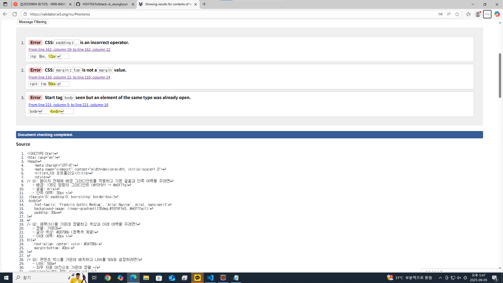

---

문제점
1. ,를 제외시켜야한다.
2. -을 포함시켜야 한다.
3. <body>로 시작해서 </body>로 끝나야한다.

해결방안
1. ,를 제외시켜야한다.
2. -을 포함시켜야 한다.
3. <body>로 시작해서 </body>로 끝나야한다.
느낀점
다양한 구문들을 배우게 되면서 배워야할 것들이 많아졌다. 코드를 입력하는데 있어서 차근차근 입력해야 될 필요가 느껴진다.
---
---
문제점.

해결방안.

느낀점.

---
